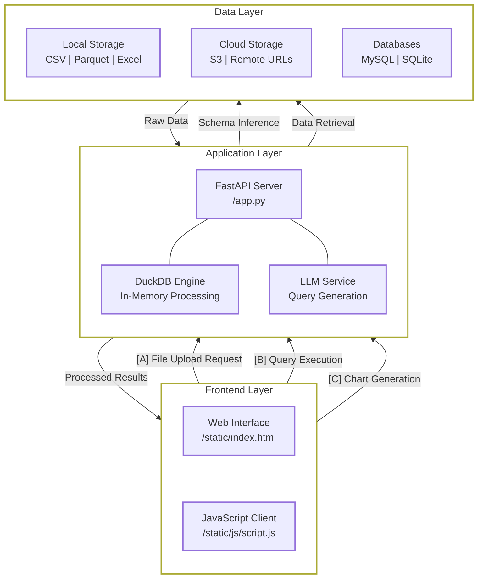

# QueryBot

A powerful web application that enables users to upload various data formats, execute SQL queries, and download results through an intuitive interface.

## Table of Contents
- [Overview](#overview)
- [Architecture](#architecture)
- [Features](#features)
- [Getting Started](#getting-started)
- [Development](#development)
- [License](#license)
- [Additional Resources](#additional-resources)
- [FAQ](#faq)

## Overview

QueryBot is built with FastAPI for the backend and a responsive HTML/Bootstrap frontend. It provides a seamless experience for data analysis by allowing users to query multiple data sources through a unified SQL interface.

## Architecture

QueryBot follows a modern client-server architecture with real-time data processing capabilities:



### Workflow

1. **Data Ingestion**
   - Users can upload local files or provide paths to remote data sources
   - Supported formats include CSV, Parquet, Excel, SQLite, and MySQL databases
   - S3 bucket integration for cloud storage access
   - Smart file format detection and schema inference

2. **Query Processing**
   - Natural language queries are converted to SQL using LLM services
   - Multiple LLM models supported (GPT-4.1-nano, GPT-4.1-mini, o4-mini, Gemini 2.5 Flash)
   - Customizable system prompts for specialized workflows
   - Automatic handling of complex data types and date formats

3. **Data Processing**
   - DuckDB engine for high-performance query execution
   - Zero-copy data access using DuckDB's native read functions
   - Direct file reading without temporary tables
   - Unified approach for all file types (CSV, Parquet, Excel, SQLite, MySQL)
   - Automatic column name handling and type inference
   - Support for complex SQL operations including joins and aggregations

4. **Visualization**
   - Dynamic chart generation using Chart.js
   - Context-aware visualization recommendations
   - Interactive data exploration capabilities
   - Export functionality for further analysis

## Features

- **Enterprise Data Integration**:
  - Native support for CSV, Parquet, SQLite, Excel, JSON, and DuckDB files
  - Zero-copy data access using DuckDB's native read functions
  - Direct file reading without temporary tables
  - Smart file format detection and handling
  - Automatic schema inference with type validation
  - Multi-dataset querying with automatic join optimization
  - Direct DuckDB access for improved performance

- **AI-Powered Query Processing**:
  - Natural language to SQL conversion using state-of-the-art LLMs
  - Multi-model support with cost-optimized options:
    - GPT-4.1-nano
    - GPT-4.1-mini
    - o4-mini
    - Gemini 2.5 Flash
  - Context-aware query generation with dataset understanding
  - Intelligent column name handling with special character support
  - Customizable system prompts for specialized workflows
  - User-editable system prompts for fine-tuned control

- **Advanced Analytics Engine**:
  - Complex temporal analysis with multi-format date handling
  - Advanced text analytics with case-insensitive pattern matching
  - Window functions and complex aggregations
  - Custom analytical workflows through system prompts
  - Automatic query optimization and execution planning
  - Enhanced date format handling

- **Interactive Data Visualization**:
  - Dynamic chart generation with Chart.js integration
  - Context-aware visualization recommendations
  - Custom visualization descriptions
  - Real-time data exploration
  - Export capabilities with CSV formatting

- **Enterprise-Grade Architecture**:
  - Query history persistence with result caching
  - Dataset-specific query suggestions
  - Comprehensive error handling and logging
  - Environment-based configuration management
  - Scalable FastAPI architecture with DuckDB backend
  - Custom JSON encoder for complex data types
  - Secure API key management

- **User Experience**:
  - Responsive design for desktop and mobile
  - Dark theme support
  - Recent files history
  - Recent queries per file
  - Toast notifications for operations
  - Loading indicators
  - Error handling with detailed messages

- **Development Features**:
  - FastAPI backend
  - DuckDB for efficient data processing
  - Custom JSON encoder for complex data types
  - Environment variable configuration
  - Extensible architecture

## Getting Started

### Installation

> **Note**: Installation is optional as `uvx` will handle the necessary setup.

```bash
pip install querybot
```

### Running the Application

1. Start the application with a single command using `uv`:
   ```bash
   uvx querybot
   ```
2. Open your web browser and navigate to [http://localhost:8001](http://localhost:8001) to access the QueryBot interface.

### Usage

1. **Upload Data**: Use the interface to specify data sources by:
   - Entering file paths (multiple paths can be separated by commas, without quotes)
   - Uploading files directly through the browser

2. **Supported Data Formats**:
   - CSV files (`.csv`)
   - Parquet files (`.parquet`)
   - SQLite databases (`.db`)
   - Excel spreadsheets (`.xlsx`)
   - External MySQL databases (from relational-data.org)

3. **Execute Queries**: Write SQL queries in the editor and click "Run Query" to see results.

4. **Export Results**: Download query results as CSV files for further analysis or reporting.

## Project Structure

```
/querybot
│
├── querybot              # Main package directory
│   ├── app.py            # FastAPI application entry point
│   ├── __init__.py       # Package initialization
│   ├── static            # Static assets
│   │   ├── index.html    # Main frontend interface
│   │   └── js            # JavaScript resources
│   │       └── script.js # Frontend functionality
├── pyproject.toml        # Project metadata and dependencies
├── .gitignore            # Git ignore configuration
├── uv.lock               # Dependency lock file
├── README.md             # Project documentation
```

## Development

### Prerequisites

- Python 3.8+

### Setting Up Development Environment

1. Clone the repository:
   ```bash
   git clone https://github.com/gramener/querybot.git
   cd querybot
   ```

2. Install dependencies:
   ```bash
   pip install -e ".[dev]"
   ```

## Deployment

Modify the `pyproject.toml` file to change the version number.

```bash
uv build
uv publish
```

This is deployed to [pypi](https://pypi.org/project/querybot/) as [s.anand@gramener.com](s.anand@gramener.com)

## License

This project is licensed under the MIT License - see the [LICENSE](LICENSE) file for details.

## Additional Resources

- [QueryBot on PyPI](https://pypi.org/project/querybot/)
- [Issue Tracker](https://github.com/gramener/querybot/issues)

## Query Result


## Contribution Guidelines

We welcome contributions! Please see our [CONTRIBUTING.md](CONTRIBUTING.md) for more details.

## FAQ

**Q: What data formats are supported?**
A: The application supports CSV, Parquet, SQLite, Excel, and MySQL formats, with direct DuckDB integration and S3 storage support.

**Q: How do I report an issue?**
A: Please use the [Issue Tracker](https://github.com/gramener/querybot/issues) to report any issues you encounter.

**Q: Can I customize the AI's behavior?**
A: Yes, you can edit the system prompt to customize how the AI interprets and processes your queries.

**Q: Does QueryBot support cloud storage?**
A: Yes, QueryBot supports accessing files directly from S3 buckets.

**Q: How does QueryBot handle different date formats?**
A: QueryBot includes enhanced date format handling that can automatically recognize and process various date formats in your data.
