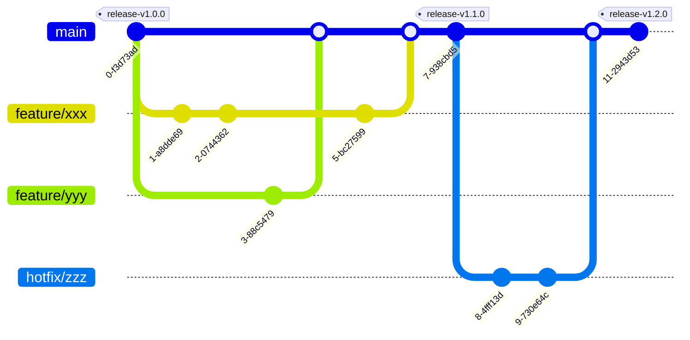

# Development Flow

## Branch Strategy

As shown in the diagram below, the feature branches (`feature/xxx`) are branched off from the `main` branch for development. The `main` branch is the release branch.




### Branch Naming

While there are no strict rules, the following naming conventions are recommended:

- `feature/xxx`: (xxx represents the feature being added)
- `bugfix/xxx`: (xxx represents the bug being fixed)
- `hotfix/xxx`: (xxx represents the urgent fix)

## Conventional Commits

The commit messages should preferably follow the　[Conventional Commits](https://www.conventionalcommits.org/en/v1.0.0/) guidelines.

### Commit Message Format

By using `.gitmessage`, a template for commit messages is provided. This template can be enabled locally for this project by configuring `git config --local`.

```bash
git config --local commit.template .gitmessage
```

Once configured, running `git commit` will display the contents of `.gitmessage` in your editor (Vim by default).

```bash
git commit
# Overview (Uncomment one of the following templates)
#feat: 
# └  A new feature
#fix:
# └  A bug fix
#docs:
# └  Documentation only changes
#style:
# └  Changes that do not affect the meaning of the code
#    (white-space, formatting, missing semi-colons, etc)
#refactor:
# └  A code change that neither fixes a bug nor adds a featur
#test:
# └  Adding missing or correcting existing tests
#ci:
# └  Changes to our CI configuration files and scripts
#chore:
# └  Updating grunt tasks etc; no production code change

```

Select the appropriate template and uncomment it, then write your commit message.

```bash
docs: Update README.md
# └  Documentation only changes
```

## Correspondence between Commit Messages and Labels

When creating a PR to the `main` branch, labels are automatically assigned based on the commit messages.
Below is the correspondence between prefixes and labels:

| Prefix | Label | Description |
|---|---|---|
|feat: | `feature` | Adding a new feature |
|fix: | `bugfix` | Bug fixes |
|docs: | `documentation` | Documentation only changes |
|style: | `style` | Changes that do not affect the meaning of the code (white-space, formatting, missing semi-colons, etc) |
|refactor: | `refactor` | Code changes that neither fix a bug nor add a feature |
|test: | `test` | Adding or correcting existing tests |
|ci: | `ci` | Adding or updating CI configuration and scripts |
|chore: | `chore` | Minor changes or maintenance tasks |
