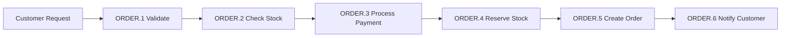
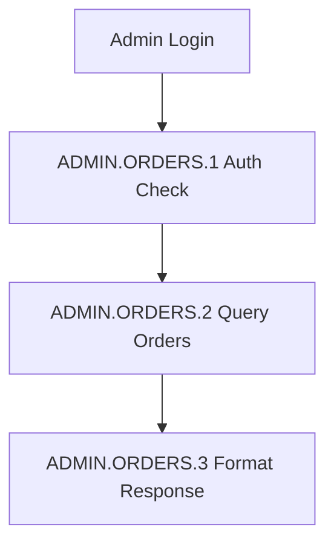
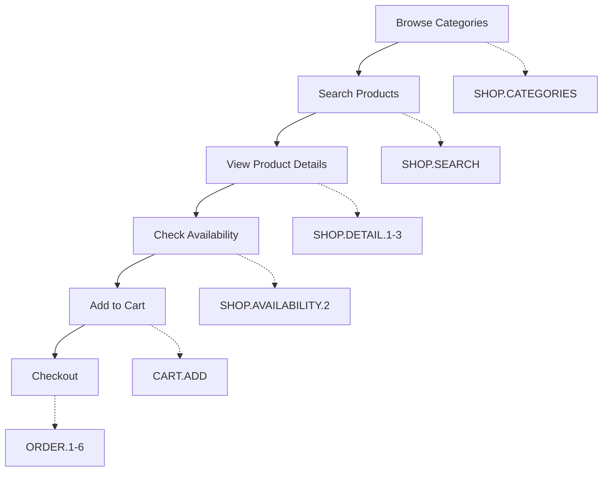
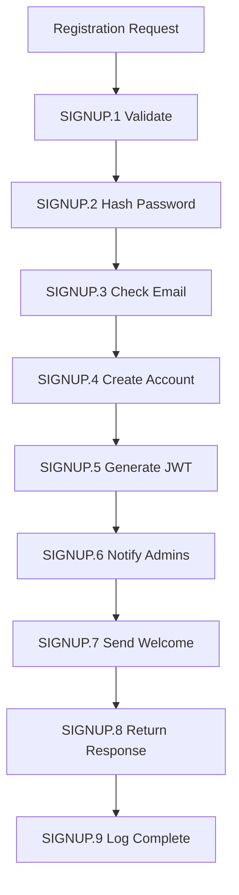
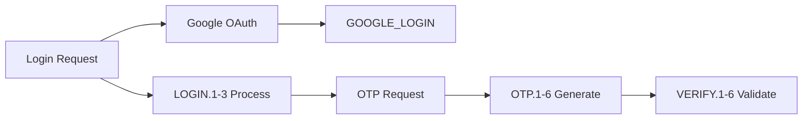
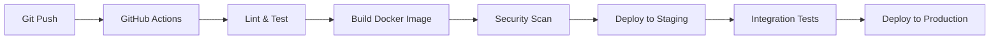
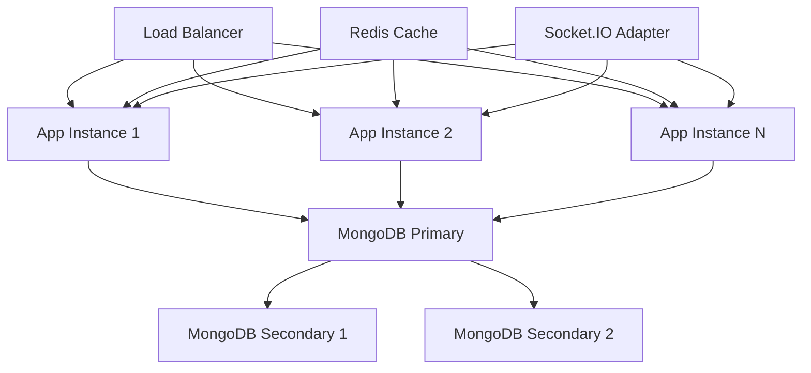

# yellowsapphire-sdk
This is the YellowSapphire Backend. Carefully read the rest of this document. 

**Rate Limits**: 100 requests/minute (public), 1000 requests/minute (authenticated)

## Authentication & Authorization

**Token-Based Authentication**: All endpoints require JWT bearer tokens obtained via login endpoints.

**Access Control**: Role-based permissions with four distinct access levels:

```
Admin      - System-wide access: User management, system configuration, all operations
Customer   - Account-scoped: Product browsing, order placement, account management  
Fulfillment - Order-scoped: Inventory management, order processing, product configuration
Logistics  - Delivery-scoped: Shipping coordination, delivery tracking, route management
```

**Get a Token**:
1. Authenticate via `/admin/login` or `/customer/login` endpoints
2. Copy pasta the token from a 200 auth response
3. Include in requests: `Authorization: Bearer <token>`
4. Use \"Authorize\" button above for interactive testing

## Implementation Notes

- JSON responses with standardized error handling
- Real-time with fcm/ws/mongochangestreams  
- correlation IDs for request tracing
- JWT auth with rbac
- fulfillment workflow with qa
- Global Error Handler middleware  

## Logging & Monitoring
**Structured Logging System**

Centralized logging with correlation ID tracking across API requests, database operations, performance metrics, and security events. JSON format optimized for log aggregation systems.

### Status Indicators
- **●** Request initiated / Processing started
- **◐** Validation / Intermediate processing step
- **✓** Operation completed successfully
- **▲** Warning condition detected
- **✗** Error or failure state
- **⚡** Performance critical operation
- **🔒** Security-related event

### Request Tracing & Correlation IDs

**End-to-End Request Tracking:**
Each API request receives a unique correlation ID that propagates through all system layers for distributed tracing and debugging.

**Correlation ID Format**: `req-{32-character-hex}` (e.g., `req-309edd90d27d3ab635d57e98697bc47d`)
- Generated at request entry point and returned in `X-Correlation-ID` header
- Enables complete request tracing across all system layers

**Timestamp Format**: ISO 8601 with millisecond precision (`2025-07-02T21:24:32.847Z`)

### Log Format
Structured JSON log format compatible with log aggregation systems (ELK Stack, Splunk, Datadog).

**Standard Log Structure:**
```json
{
  \"@timestamp\": \"2025-07-02T21:24:32.847Z\",
  \"@level\": \"info\",
  \"service\": {
    \"name\": \"yellowsapphire-backend\",
    \"version\": \"2.2.0\",
    \"environment\": \"production\"
  },
  \"location\": {
    \"source\": \"controller\",
    \"module\": \"CustomerController\",
    \"method\": \"CustomerLogin\"
  },
  \"message\": \"✓ [CUSTOMER.LOGIN.3] Customer authentication successful\",
  \"data\": {
    \"correlationId\": \"req-309edd90d27d3ab635d57e98697bc47d\",
    \"ip\": \"197.242.156.23\",
    \"userAgent\": \"Mozilla/5.0 (iPhone; CPU iPhone OS 17_0 like Mac OS X)\",
    \"engineering\": {
      \"functionName\": \"CustomerLogin()\",
      \"operationResult\": \"authentication_successful\",
      \"authenticationDuration\": \"89ms\",
      \"databaseQueryDuration\": \"12ms\",
      \"totalOperationDuration\": \"156ms\",
      \"performanceCategory\": \"acceptable\",
      \"securityEvent\": \"customer_login_success\",
      \"customerId\": \"60f7b8c...\",
      \"responseStatus\": 200,
      \"jwtTokenGenerated\": true,
      \"loginAttemptNumber\": 1
    }
  },
  \"metadata\": {
    \"processId\": 1954,
    \"hostname\": \"api-server-prod-01\",
    \"memoryUsageMB\": 375,
    \"uptime\": \"4h 18m 32s\",
    \"requestMethod\": \"POST\",
    \"endpoint\": \"/api/customer/login\",
    \"statusCode\": 200
  }
}
```


### Log Categories & Workflow Steps

Each business operation is broken down into numbered steps that trace the complete workflow. This allows precise debugging and performance monitoring at each stage.

**Feedback Mechanisms & Quality Assurance:**
- **[CUSTOMER.RATING]**: Product and service rating submission with quality metrics
- **[FEEDBACK.COLLECTION.1-4]**: Customer satisfaction surveys and feedback processing
- **[QUALITY.REVIEW.1-3]**: Internal quality assurance workflows and improvement tracking
- **[SUPPORT.TICKET.1-5]**: Customer support ticket lifecycle management
- **[PERFORMANCE.FEEDBACK]**: System performance feedback loops and optimization triggers

**MongoDB Change Streams & Real-time Events:**

| Change Stream | Collection | Event Types | Socket.IO Event | Purpose |
|---------------|------------|-------------|-----------------|---------|
| **Product Stream** | `products` | insert, update, delete | `inventory:product_update` | New product creation, price changes, description updates |
| **Inventory Stream** | `products` | update (stock field) | `inventory:stock_change` | Stock level modifications, low stock alerts |
| **Order Stream** | `orders` | insert, update | `orders:status_change` | Order creation, status transitions, delivery updates |
| **Stock Reservation Stream** | `stockreservations` | insert, update, delete | `inventory:reservation_update` | Stock holds, reservation expiry, release events |
| **Inventory Transaction Stream** | `inventorytransactions` | insert | `inventory:transaction` | Stock movements, audit trail, transaction analytics |
| **Customer Stream** | `customers` | insert, update | `customer:profile_update` | Registration, profile changes, verification status |
| **Admin Stream** | `admins` | insert, update, delete | `admin:user_management` | Admin user lifecycle, permission changes |
| **Category Stream** | `categories` | insert, update, delete | `catalog:category_update` | Category structure changes, navigation updates |
| **Banner Stream** | `adbanners` | insert, update, delete | `content:banner_update` | Marketing content changes, campaign updates |

**Change Stream Processing Workflow:**
```
1. MongoDB Change Event → 2. Change Stream Processor → 3. Event Transformation → 4. Socket.IO Broadcast → 5. Client Handlers
```

**Real-time Notification Triggers:**
- **Low Stock Alert**: Triggered when product quantity ≤ reorder level
- **Order Status Change**: Immediate notification on status transitions
- **New Product Alert**: Admin notification for product additions
- **Critical Stock**: Emergency alerts for zero inventory

### MongoDB Transaction System & ACID Compliance

**Transaction-Safe Order Processing:**

Critical business operations (order creation, inventory updates, payment processing) are wrapped in MongoDB transactions to ensure data consistency and ACID compliance.

**Transaction Service Features:**
- **Automatic Retry Logic**: Exponential backoff for transient failures (network issues, write conflicts)
- **Rollback Guarantee**: Automatic transaction rollback on any operation failure
- **Correlation ID Tracking**: Complete transaction tracing through distributed systems
- **Performance Monitoring**: Transaction duration and retry metrics
- **Business-Friendly Logging**: Non-technical log messages for operations teams

**Transaction Log Categories:**
- **[DATABASE.TRANSACTION.1-N]**: Individual transaction attempt tracking
- **[DATABASE.SEQUENCE.1-N]**: Sequential operation execution within transactions
- **[DATABASE.TRANSACTION.FAILED]**: Terminal transaction failures after all retries

**Supported Operations:**
```
• Order Creation (Customer + Order + Inventory Update)
• Stock Reservations (Reserve + Timeout + Release)
• Payment Processing (Payment + Order Status + Notification)
• Inventory Adjustments (Stock + Transaction Log + Audit Trail)
```

**Transaction Configuration:**
- **Read Concern**: majority (consistent reads)
- **Write Concern**: majority with journal acknowledgment
- **Max Retries**: 3 attempts with exponential backoff
- **Timeout**: 30 seconds per transaction
- **Retry Delays**: 100ms, 200ms, 400ms

**Error Handling:**
```
Retryable Errors: TransientTransactionError, UnknownTransactionCommitResult, WriteConflict
Non-Retryable: ValidationError, AuthenticationError, BusinessLogicError
```
- **Payment Confirmation**: Real-time order payment updates


#### **Order Management Workflows**

**Order Placement Flow:**


**Admin Order Management:**


- **[CUSTOMER.ORDER.1-6]**: Complete order placement process
- **[ADMIN.ORDERS.1-3]**: Order management operations
- **[ADMIN.ORDER_GET.2]**: Order details retrieval by admin
- **[ADMIN.ORDER_STATUS.2]**: Order status updates
- **[ORDERS.GET]**: General order queries

#### **Product & Inventory Management**

**Product Creation Flow:**
```
[Admin Request] --> [PRODUCT.1 Validate]  --> [PRODUCT.2 Barcode Lookup] --> [PRODUCT.3 Process Data] --> [PRODUCT.4 Save & Initialize]
```

**Inventory Update Flow:**
```
[Stock Request] --> B[INVENTORY.1 Validate]   --> [INVENTORY.2 Lock Transaction]  --> [INVENTORY.3 Calculate] --> [INVENTORY.4 Update DB] --> INVENTORY.5 Notify]
```

- **[ADMIN.PRODUCT.1-4]**: Product management workflow
- **[INVENTORY.1-5]**: Stock operation tracking
- **[ADMIN.PRODUCTS.1-2]**: Product catalog management
- **[ADMIN.PRODUCT_GET.2]**: Individual product administration
- **[ADMIN.BARCODE_LOOKUP]**: Product lookup via barcode scanning
- **[ADMIN.CREATE_FROM_BARCODE.2]**: Product creation from barcode data
- **[ADMIN.BULK_PRODUCTS]**: Bulk product operations
- **[ADMIN.STOCK]**: Inventory level management
- **[ADMIN.CATEGORY_CREATE.1]**: Product category creation

#### **Shopping & E-commerce Workflows**

**Customer Shopping Journey:**


**Offers & Promotions Flow:**


- **[SHOP.SEARCH]**: Product search and filtering
- **[SHOP.PRODUCT_DETAIL.1-3]**: Product detail retrieval with availability check
- **[SHOP.CATEGORIES]**: Category browsing and navigation
- **[SHOP.FEATURED.1-2]**: Featured products display
- **[SHOP.OFFERS.1-6]**: Special offers and promotions workflow
- **[SHOP.QUICK_DELIVERY.1-2]**: Express delivery options
- **[SHOP.TOP_STORES.1-2]**: Popular store listings
- **[SHOP.STORE_BY_ID.1-2]**: Individual store information
- **[SHOP.PRODUCT_AVAILABILITY.2]**: Real-time stock checking

#### **Cart Management Workflows**
- **[CART.GET]**: Cart contents retrieval
- **[CART.DELETE_ITEM.1-5]**: Individual item removal from cart
- **[CART.CLEAR.2-6]**: Complete cart clearance

#### **Customer Management Workflows**

**Customer Registration Flow:**


**Authentication & Verification:**


- **[CUSTOMER.SIGNUP.1-9]**: Complete customer registration process
  - **[CUSTOMER.SIGNUP.1]**: Initial request processing - correlation ID generation and metadata capture
  - **[CUSTOMER.SIGNUP.1.1]**: DTO validation using class-validator - email, phone, password, firstName, lastName format checks
  - **[CUSTOMER.SIGNUP.1.2]**: Field-level validation - email normalization, phone format (10 digits), password strength (6-20 chars)
  - **[CUSTOMER.SIGNUP.2]**: Cryptographic operations - bcrypt salt generation and password hashing with performance tracking
  - **[CUSTOMER.SIGNUP.3]**: Email uniqueness validation - database query Customer.findOne({email}) to prevent duplicates
  - **[CUSTOMER.SIGNUP.4]**: Customer account creation - MongoDB document with default values (verified: false, receivemarketing: true)
  - **[CUSTOMER.SIGNUP.5]**: JWT token generation - 1-day expiration with customer ID, email, and verification status claims
  - **[CUSTOMER.SIGNUP.6]**: FCM notification to admins - Firebase topic 'admin' with new signup alert (non-blocking)
  - **[CUSTOMER.SIGNUP.7]**: Welcome email dispatch - Brevo SMTP with Handlebars template to customer email (asynchronous)
  - **[CUSTOMER.SIGNUP.8]**: Response preparation - 201 status with token, verified: false, email, and success message
  - **[CUSTOMER.SIGNUP.9]**: Completion logging - total duration tracking and correlation ID logging
- **[CUSTOMER.LOGIN.1-3]**: Customer authentication with OAuth support
- **[CUSTOMER.GOOGLE_LOGIN]**: Google OAuth integration
- **[CUSTOMER.OTP_REQUEST.1-6]**: OTP generation and delivery (SMS currently disabled)
- **[CUSTOMER.VERIFY.1-6]**: Account verification process with OTP validation
- **[CUSTOMER.PROFILE_GET.2]**: Customer profile retrieval
- **[CUSTOMER.PROFILE_EDIT.1-4]**: Profile update operations
- **[CUSTOMER.FIREBASE_TOKEN.1-4]**: Firebase token management for notifications
- **[CUSTOMER.ORDER_GET.1]**: Customer order history
- **[CUSTOMER.RATING]**: Product and service rating submission

#### **Admin Management Workflows**
- **[ADMIN.CREATE]**: New admin account creation
- **[ADMIN.UPDATE.1-4]**: Admin profile updates
- **[ADMIN.DELETE]**: Admin account deletion
- **[ADMIN.GET_BY_ID.1-2]**: Individual admin retrieval
- **[ADMIN.LIST.1-2]**: Admin user listing
- **[ADMIN.PASSWORD_RESET.1-5]**: Admin password reset process
- **[ADMIN.CUSTOMER_LIST.1-3]**: Customer management operations
- **[ADMIN.CUSTOMER_UPDATE.1-3]**: Customer profile administration
- **[ADMIN.CUSTOMER_DELETE.2]**: Customer account removal
- **[ADMIN.CUSTOMER_GET.2]**: Customer profile retrieval by admin


#### **Content Management Workflows**
- **[ADMIN.BANNER_CREATE.1-3]**: Advertisement banner creation
- **[ADMIN.BANNER_UPDATE.1-5]**: Banner content updates
- **[ADMIN.BANNER_LIST.1-3]**: Banner management and listing

#### **Payment Processing Workflows**
- **[PAYMENT.GATEWAY]**: Payment gateway integration
- **[PAYMENT.GATEWAY.BANK]**: Bank transfer processing
- **[PAYMENT.GATEWAY.GPAY]**: Google Pay integration
- **[PAYMENT.GATEWAY.PO]**: Purchase order processing

#### **Communication & Notifications**
- **[EMAIL.1-5]**: Email delivery workflow
- **[FCM.1-2]**: Push notification delivery

#### **System Operations**
- **[DB.1-3]**: Database operation monitoring

- **[RATE_LIMIT]**: Security event tracking
- **[VALIDATION.OBJECTID]**: Input validation for database operations
- **[CORRELATION.CLEANUP]**: Request context management

### Performance Metrics & Monitoring

**Execution Time Tracking:**
Every operation includes precise timing data for performance analysis and optimization.

```json
\"engineering\": {
  \"authenticationDuration\": \"89ms\",
  \"databaseQueryDuration\": \"12ms\",
  \"totalOperationDuration\": \"156ms\",
  \"performanceCategory\": \"acceptable\"
}
```

**Performance Classifications:**
- **⚡ Optimal** (<100ms): Lightning fast, minimal resource usage
  - *Target*: Authentication, simple queries, cache hits
  - *Example*: `[CUSTOMER.PROFILE.2] Profile data retrieved (43ms) - optimal`

- **✓ Acceptable** (100-500ms): Good performance within normal range
  - *Target*: Complex queries, order processing, payment validation
  - *Example*: `[ORDER.CREATE.3] Payment processing completed (287ms) - acceptable`

- **▲ Slow** (500ms-2s): Requires attention, may impact user experience
  - *Action*: Investigate query optimization, caching opportunities
  - *Example*: `[INVENTORY.2] Stock calculation completed (743ms) - slow`

- **✗ Critical** (>2s): Unacceptable performance, immediate optimization required
  - *Action*: Emergency investigation, potential timeout issues
  - *Example*: `[EMAIL.4] SMTP delivery attempt (2.1s) - critical`

**System Resource Monitoring:**
- **Memory Usage**: V8 heap utilization and garbage collection patterns
- **Database Performance**: Connection pool status, query execution times
- **External APIs**: Response times for barcode lookups, payment processors
- **Security Operations**: Cryptographic operation timing (bcrypt, JWT)
- **Network Operations**: SMTP delivery, FCM push notifications

### Security & Privacy Protection

**Data Sanitization Standards:**
All sensitive data is automatically sanitized before logging to prevent accidental exposure.

```
Passwords      → password: [HIDDEN]      (Authentication tracking without credentials)
JWT Tokens     → authorization: [HIDDEN] (Security without token exposure)
API Keys       → apikey: [HIDDEN]        (Access tracking without key exposure)
Email Addresses → email: [HIDDEN]        (User identification with privacy protection)
Phone Numbers  → phone: [HIDDEN]         (Contact tracking without number exposure)
```

**Security Event Tracking:**
- **Authentication Events**: Login attempts, failures, security violations
- **Authorization Events**: Permission checks, role validations, access denials
- **Rate Limiting**: Request frequency monitoring and abuse detection
- **Input Validation**: Malicious input detection and sanitization
- **Session Management**: Token lifecycle, expiration, and invalidation

**Compliance & Auditing:**
- **GDPR Compliance**: No personal data in logs, sanitized identifiers only
- **Security Auditing**: All authentication and authorization events tracked
- **Incident Response**: Correlation IDs enable complete request tracing
- **Performance Auditing**: System performance tracking for SLA compliance

### Error Handling & Recovery

**Environment-Specific Error Reporting:**
- **Development**: Detailed stack traces, variable states, debugging context
- **Production**: Sanitized error messages with correlation IDs for internal tracking

**Error Categories & Response Strategies:**

| Error Type | Log Pattern | Recovery Action | User Impact |
|------------|-------------|-----------------|-------------|
| Validation Errors | `[VALIDATION.ERROR]` | Return 400 with specific field errors | Immediate feedback for correction |
| Authentication Failures | `[AUTH.ERROR]` | Return 401, log security event | Redirect to login, rate limit protection |
| Authorization Violations | `[AUTHZ.ERROR]` | Return 403, audit trail | Access denied with support contact |
| Database Errors | `[DB.ERROR]` | Retry logic, fallback queries | Temporary service degradation notice |
| External API Failures | `[API.ERROR]` | Circuit breaker, cached responses | Graceful degradation or retry prompts |
| Business Logic Errors | `[BUSINESS.ERROR]` | Transaction rollback, state recovery | Clear error message with resolution steps |

**Error Context Preservation:**
```json
{
  \"error\": {
    \"message\": \"Validation failed for customer profile\",
    \"code\": \"VALIDATION_ERROR\",
    \"details\": {
      \"field\": \"email\",
      \"reason\": \"Invalid email format\",
      \"providedValue\": \"user...@invalid\"
    }
  }
}
```

### Security Headers
- **X-Content-Type-Options**: Prevents MIME type sniffing
- **X-Frame-Options**: Protects against clickjacking attacks  
- **X-XSS-Protection**: Enables browser XSS filtering
- **Content-Security-Policy**: Restricts resource loading


### Company Information
**Website**: [yellowsapphire.co.za](https://yellowsapphire.co.za)  
**Business**: Computer Equipment  
**Location**: Fourways, Johannesburg

## Timezone 
- **Format**: ISO 8601 with timezone offset (e.g., `2025-06-22T16:30:45.123+02:00`)

## Error Handling & Response Format
**Structured Error Response System**

All API errors follow a consistent, structured format for predictable error handling and debugging.

### Standard Error Response Format
```json
{
  \"error\": \"VALIDATION_FAILED\",
  \"message\": \"Human-readable error description\",
  \"correlationId\": \"req-b54f0f5afc234b1239cc5ff6bc8f1bdc\",
  \"timestamp\": \"2025-07-03T02:32:17.941Z\",
  \"details\": [
    {
      \"field\": \"email\",
      \"constraint\": \"required\",
      \"value\": \"\",
      \"message\": \"Email is required\"
    }
  ]
}
```

### Error Types & HTTP Status Codes

| Error Type | HTTP Status | Description | Use Case |
|------------|-------------|-------------|----------|
| `VALIDATION_FAILED` | 400 | Invalid input data or missing required fields | Form validation, parameter validation |
| `AUTHENTICATION_FAILED` | 401 | Invalid or missing authentication credentials | Login failures, expired tokens |
| `AUTHORIZATION_FAILED` | 403 | Insufficient permissions for requested resource | Role-based access control violations |
| `RESOURCE_NOT_FOUND` | 404 | Requested resource does not exist | Invalid IDs, deleted resources |
| `CONFLICT` | 409 | Resource conflict or duplicate data | Duplicate email registration, concurrent modifications |
| `BUSINESS_ERROR` | 422 | Business rule violation | Insufficient stock, order cancellation rules |
| `INTERNAL_SERVER_ERROR` | 500 | Unexpected server error | Database failures, external service errors |


### Business Logic Errors (422)
Include business rule context and error codes:
```json
{
  \"error\": \"BUSINESS_ERROR\",
  \"message\": \"Order cannot be cancelled. Current status: shipped\",
  \"code\": \"ORDER_NOT_CANCELLABLE\",
  \"correlationId\": \"req-def456...\",
  \"timestamp\": \"2025-07-03T02:32:17.941Z\"
}
```

### Error Response Headers
All error responses include these headers:
- `X-Correlation-ID`: Request correlation ID for tracing
- `Content-Type`: `application/json`
- `X-RateLimit-*`: Rate limiting information (when applicable)

### Client Error Handling Best Practices
1. **Always check the `error` field** for programmatic error handling
2. **Use `correlationId`** when reporting issues to support
3. **Parse `details` array** for field-specific validation errors
4. **Display `message`** to users for human-readable feedback
5. **Implement retry logic** for 5xx errors with exponential backoff

## Real-time Events (Socket.IO)
Real-time event streaming via Socket.IO WebSocket connections for inventory and order updates.

### Connection Endpoint
```javascript
// Connect to Socket.IO server
const socket = io('https://yellowsapphire-backend-826925162454.africa-south1.run.app');

// Authenticate connection
socket.emit('authenticate', 'your_jwt_token');
```

### Real-time Event Categories

#### Inventory Events
1. **inventory:product_update** - New product creation
2. **inventory:stock_change** - Stock level and reservation changes  
3. **inventory:transaction** - Inventory transaction analytics
4. **inventory:reservation_update** - Stock reservation lifecycle

#### Order Events  
1. **orders:status_change** - Order status transitions

#### FCM Push Notifications
1. **admin_notifications** - New order alerts
2. **inventory_alerts** - Low/critical stock alerts

### Event Payload Structure
All events include:
- **timestamp**: ISO 8601 event time
- **correlationId**: Request correlation tracking
- **type**: Specific event type (e.g., 'product_created', 'stock_change')
- **data**: Event-specific payload

### Authentication
Socket.IO connections require JWT authentication via the 'authenticate' event.
Failed authentication triggers 'authentication_error' event.

## API Versioning & Compatibility

**Current Version**: 2.2.0

**Version Strategy**: Semantic versioning (MAJOR.MINOR.PATCH)
- **MAJOR**: Breaking changes requiring client updates
- **MINOR**: New features with backward compatibility  
- **PATCH**: Bug fixes and security updates

**Deprecation Policy**: 
- 6-month notice for breaking changes
- Legacy endpoint support for 2 major versions
- Migration guides provided for deprecated features

## Data Models & Relationships

**Core Entities:**

| Entity | Primary Key | Relationships | Change Stream |
|--------|-------------|---------------|---------------|
| **Customer** | `_id` | → Orders, Ratings | `customer:profile_update` |
| **Admin** | `_id` | → Created Products, Orders | `admin:user_management` |
| **Product** | `_id` | ← Categories, → Inventory | `inventory:product_update` |
| **Order** | `_id` | ← Customer, → OrderItems | `orders:status_change` |
| **Category** | `_id` | → Products | `catalog:category_update` |
| **StockReservation** | `_id` | ← Product, ← Order | `inventory:reservation_update` |
| **InventoryTransaction** | `_id` | ← Product, ← Admin | `inventory:transaction` |
| **AdBanner** | `_id` | ← Admin Created | `content:banner_update` |

**Data Consistency Rules:**
- Stock reservations auto-expire after 15 minutes
- Order cancellation allowed only in 'pending' or 'confirmed' status
- Inventory transactions maintain audit trail integrity
- Customer verification required for high-value orders

## Business Rules & Constraints

**Order Management Rules:**
```yaml
Order Lifecycle:
  - pending → confirmed → processing → shipped → delivered
  - Cancellation: Only 'pending' and 'confirmed' statuses
  - Refunds: Within 30 days of delivery
  - Stock: Reserved during 'pending', committed on 'confirmed'

Inventory Rules:
  - Minimum stock alerts at reorder level
  - Negative stock prevention with real-time validation
  - Automatic stock reservation for 15-minute checkout window
  - Bulk operations require admin approval

Customer Rules:
  - Email verification required for orders > R5000
  - Phone verification for new accounts
  - Rate limiting: 5 login attempts per 15 minutes
  - Password complexity: 8+ characters, mixed case
```

**Business Validation Constraints:**
- Product prices must be positive decimals
- Order quantities limited to available stock + buffer
- Customer profiles require validated South African phone numbers
- Admin permissions hierarchical (read → write → admin → super)

## Performance Optimization

**Caching Strategy:**
- **Product Catalog**: Redis cache with 1-hour TTL
- **Category Navigation**: In-memory cache with change stream invalidation
- **Featured Products**: Database view with scheduled refresh
- **User Sessions**: JWT stateless authentication

**Database Optimization:**
- Compound indexes on frequent query patterns
- Aggregation pipeline optimization for analytics
- Connection pooling with 10 concurrent connections
- Read replicas for reporting and analytics queries

**Response Time Targets:**

| Endpoint Category | Target Response Time | Monitoring Alert |
|-------------------|---------------------|------------------|
| Authentication | < 200ms | > 500ms |
| Product Catalog | < 300ms | > 800ms |
| Order Creation | < 1000ms | > 2000ms |
| Admin Reports | < 2000ms | > 5000ms |
| Real-time Events | < 50ms | > 200ms |

## Security Implementation

**Authentication & Authorization Matrix:**

| Role | Product Management | Order Management | User Management | System Config |
|------|-------------------|------------------|-----------------|---------------|
| **Customer** | Read Only | Own Orders Only | Own Profile | None |
| **Fulfillment** | Read/Update Stock | All Orders | None | None |
| **Logistics** | Read Only | Update Shipping | None | None |
| **Admin** | Full Access | Full Access | Customer Management | Limited |
| **Super Admin** | Full Access | Full Access | Full Access | Full Access |

**Security Headers & Policies:**
```http
Content-Security-Policy: default-src 'self'; script-src 'self' 'unsafe-inline'
X-Content-Type-Options: nosniff
X-Frame-Options: DENY  
X-XSS-Protection: 1; mode=block
Referrer-Policy: strict-origin-when-cross-origin
```

**Rate Limiting Configuration:**
- **Authentication endpoints**: 5 requests/15 minutes per IP
- **Password reset**: 3 requests/hour per account
- **Product search**: 100 requests/minute per user
- **Order creation**: 10 requests/minute per customer
- **Admin operations**: 1000 requests/minute per admin

## Integration Ecosystem

**External API Integrations:**

| Service | Purpose | Endpoint Pattern | Timeout | Retry Policy |
|---------|---------|------------------|---------|--------------|
| **Brevo SMTP** | Email delivery | `/v3/smtp/email` | 30s | 3 attempts |
| **Firebase FCM** | Push notifications | `/fcm/send` | 10s | 2 attempts |
| **Cloudinary** | Image processing | `/v1_1/{cloud}/upload` | 60s | 1 attempt |
| **Barcode Lookup** | Product data | `/barcode/{ean}` | 15s | 2 attempts |
| **Payment Gateway** | Transaction processing | `/payment/process` | 45s | 3 attempts |

**Integration Monitoring:**
- Circuit breaker pattern for external failures
- Fallback responses for non-critical integrations
- Health checks for dependency monitoring
- SLA tracking and alerting thresholds

## Deployment Architecture

**Environment Configuration:**

| Environment | Server | Database | Monitoring | CDN |
|-------------|--------|----------|------------|-----|
| **Development** | Local Node.js | MongoDB Atlas | Console logs | Local static |
| **Staging** | Google Cloud Run | MongoDB Atlas | Cloud Logging | Cloud CDN |
| **Production** | Google Cloud Run | MongoDB Atlas | Cloud Operations | Cloud CDN |

**Infrastructure Components:**
```yaml
Load Balancer:
  - Health check: /health endpoint
  - SSL termination with automatic renewal
  - Geographic routing for performance

Application Layer:
  - Horizontal auto-scaling (2-10 instances)
  - Zero-downtime deployments
  - Blue-green deployment strategy

Data Layer:
  - MongoDB Atlas M10+ clusters
  - Automated backups every 6 hours
  - Point-in-time recovery capability
  - Read replicas for analytics

Monitoring Stack:
  - Google Cloud Operations Suite
  - Custom dashboards for business metrics
  - Alert policies for SLA violations
  - Log aggregation and analysis
```

## DevOps & CI/CD Pipeline

**Continuous Integration:**


**Deployment Checklist:**
- ✅ All tests passing (unit, integration, e2e)
- ✅ Security vulnerability scan complete
- ✅ Database migration scripts validated
- ✅ Environment variables updated
- ✅ Monitoring alerts configured
- ✅ Rollback plan documented

**Health Check Endpoints:**
- `/health` - Basic server health
- `/health/detailed` - Component status
- `/health/dependencies` - External service status
- `/metrics` - Prometheus-compatible metrics

## Analytics & Business Intelligence

**Key Performance Indicators (KPIs):**

| Metric Category | KPI | Target | Alert Threshold |
|-----------------|-----|--------|-----------------|
| **Performance** | API Response Time | < 500ms | > 1000ms |
| **Availability** | Uptime | 99.9% | < 99.5% |
| **Business** | Order Conversion | > 15% | < 10% |
| **Customer** | Registration Rate | > 5/day | < 2/day |
| **Inventory** | Stock Turnover | > 80% | < 60% |

**Analytics Data Flow:**
```
User Actions → Event Logging → Data Pipeline → Analytics Dashboard → Business Insights
```

**Reporting Capabilities:**
- Real-time inventory levels and alerts
- Customer behavior analytics and patterns
- Order fulfillment metrics and bottlenecks
- Revenue tracking and forecasting
- System performance and reliability metrics

## Disaster Recovery & Business Continuity

**Backup Strategy:**
- **Database**: Automated daily backups with 30-day retention
- **Application Code**: Git repository with multiple remotes
- **Configuration**: Infrastructure as Code (Terraform)
- **Secrets**: Encrypted backup in secure vault

**Recovery Time Objectives (RTO):**
- **Critical Services**: 15 minutes
- **Full System**: 2 hours
- **Data Recovery**: 1 hour

**Recovery Point Objectives (RPO):**
- **Transactional Data**: 5 minutes
- **Configuration Changes**: 1 hour
- **Analytics Data**: 24 hours

**Incident Response Procedures:**
1. **Detection**: Automated monitoring alerts
2. **Assessment**: Severity classification (P0-P4)
3. **Response**: Escalation matrix activation
4. **Communication**: Status page updates
5. **Resolution**: Root cause analysis
6. **Post-mortem**: Process improvement

## Developer Experience & Onboarding

**Development Environment Setup:**
```bash
# Clone repository
git clone https://github.com/company/yellowsapphire-backend

# Install dependencies
npm install

# Configure environment
cp .env.example .env.local

# Start development server
npm run dev

# Run tests
npm test
```

**API Testing Tools:**
- **Postman Collections**: Pre-configured request collections
- **Newman CLI**: Automated API testing
- **Swagger UI**: Interactive API documentation
- **Jest**: Unit and integration testing
- **Supertest**: HTTP assertion testing

**Code Quality Standards:**
- **TypeScript**: Strict type checking enabled
- **ESLint**: Consistent code style enforcement
- **Prettier**: Automatic code formatting
- **Husky**: Pre-commit hooks for quality gates
- **SonarQube**: Code quality and security analysis

## Troubleshooting Guide

**Common Issues & Solutions:**

| Issue | Symptoms | Root Cause | Solution |
|-------|----------|------------|----------|
| **High Response Time** | API calls > 2s | Database connection pool exhaustion | Restart service, check connection limits |
| **Authentication Failures** | 401 errors increasing | JWT token expiration | Verify token generation and expiry settings |
| **Stock Inconsistency** | Negative inventory | Race condition in concurrent updates | Review transaction isolation levels |
| **Failed Email Delivery** | Emails not sending | SMTP service disruption | Check Brevo service status and credentials |
| **Real-time Events Down** | Socket.IO disconnections | WebSocket connection limits | Scale Socket.IO instances |

**Debug Information Collection:**
```bash
# System health check
curl http://localhost:3000/health/detailed

# Application logs
docker logs yellowsapphire-backend --tail=100

# Database connection status
mongosh --eval \"db.adminCommand('connPoolStats')\"

# Memory usage analysis
node --inspect app.js # Enable debugger
```

**Monitoring & Alerting:**
- **Error Rate**: > 5% triggers immediate alert
- **Response Time**: > 1s average triggers warning
- **Database**: Connection pool > 80% triggers alert
- **Memory**: Heap usage > 90% triggers critical alert
- **Disk Space**: < 10% free triggers urgent alert

## Feature Flags Configuration 

**Environment Variables Reference:**

| Variable | Type | Default | Description | Required |
|----------|------|---------|-------------|----------|
| `NODE_ENV` | string | development | Runtime environment | ✅ |
| `PORT` | number | 3000 | Server listening port | ✅ |
| `MONGODB_URI` | string | - | MongoDB connection string | ✅ |
| `JWT_SECRET` | string | - | JWT signing secret (256-bit) | ✅ |
| `JWT_EXPIRES_IN` | string | 24h | Token expiration time | ❌ |
| `BCRYPT_ROUNDS` | number | 12 | Password hashing rounds | ❌ |
| `RATE_LIMIT_WINDOW` | number | 900000 | Rate limit window (15 min) | ❌ |
| `RATE_LIMIT_MAX` | number | 100 | Max requests per window | ❌ |
| `BREVO_API_KEY` | string | - | Email service API key | ✅ |
| `FIREBASE_PROJECT_ID` | string | - | Firebase project identifier | ✅ |
| `CLOUDINARY_CLOUD_NAME` | string | - | Image service cloud name | ✅ |
| `SOCKET_IO_CORS_ORIGIN` | string | * | WebSocket CORS origins | ❌ |
| `LOG_LEVEL` | string | info | Logging verbosity level | ❌ |

**Feature Flags & Toggles:**
```json
{
  \"features\": {
    \"realTimeInventory\": true,
    \"advancedAnalytics\": true,
    \"multiCurrencySupport\": false,
    \"socialAuthentication\": false,
    \"advancedSearch\": true,
    \"bulkOperations\": true,
    \"webhookNotifications\": false,
    \"experimentalFeatures\": false
  },
  \"limits\": {
    \"maxOrderItems\": 50,
    \"maxFileUploadSize\": \"10MB\",
    \"maxConcurrentConnections\": 1000,
    \"maxBulkOperationSize\": 100
  }
}
```

##Security Features

**Input Validation & Sanitization:**
```typescript
// DTO Validation Pipeline
Request → Class Transformer → Class Validator → Business Logic

// Sanitization Rules
- SQL Injection: Parameterized queries only
- XSS Prevention: HTML entity encoding
- NoSQL Injection: Schema validation
- Path Traversal: Whitelist allowed paths
- Command Injection: Input type validation
```

**Encryption Stds:**
- **Passwords**: bcrypt 12 rounds
- **JWT Tokens**: HMAC SHA-256 signing
- **Data at Rest**: MongoDB encryption with customer-managed keys
- **Data in Transit**: TLS 1.3 minimum, perfect forward secrecy
- **Sensitive Fields**: AES-256-GCM for PII data

**Security Audit Trail:**
```yaml
Authentication Events:
  - Login attempts (success/failure)
  - Password changes
  - Account lockouts
  - Token generation/expiration

Authorization Events:
  - Permission checks
  - Role assignments
  - Access denials
  - Privilege escalations

Data Access Events:
  - Customer data queries
  - Order modifications
  - Inventory adjustments
  - Admin operations
```

## Scalability & Performance Patterns

**Horizontal Scaling Architecture:**


**Caching Strategies:**

| Cache Type | Technology | TTL | Invalidation Strategy |
|------------|------------|-----|----------------------|
| **Application** | In-Memory Map | 5 min | Time-based expiry |
| **Database Query** | Redis | 1 hour | Change stream triggers |
| **Session Data** | Redis | 24 hours | User logout/timeout |
| **Static Assets** | CDN | 1 year | Version-based cache busting |
| **API Responses** | Redis | 15 min | Manual invalidation |

**Database Optimization Patterns:**
```javascript
// Compound Indexes for Common Queries
db.products.createIndex({ 
  \"category\": 1, 
  \"price\": 1, 
  \"stock\": 1 
});

// Partial Indexes for Conditional Queries
db.orders.createIndex(
  { \"customerId\": 1, \"status\": 1 },
  { partialFilterExpression: { \"status\": { $ne: \"cancelled\" } } }
);

// Text Search Indexes
db.products.createIndex({
  \"name\": \"text\",
  \"description\": \"text\",
  \"tags\": \"text\"
});
```

## API Client SDKs & Libraries

**Official Client Libraries:**

| Language | Package Name | Version | Documentation |
|----------|--------------|---------|---------------|
| **JavaScript** | `@yellowsapphire/api-client` | 2.1.0 | [JS Docs](./sdk/javascript) |
| **Python** | `yellowsapphire-sdk` | 2.1.0 | [Python Docs](./sdk/python) |
| **PHP** | `yellowsapphire/api-client` | 2.1.0 | [PHP Docs](./sdk/php) |
| **Java** | `com.yellowsapphire:api-client` | 2.1.0 | [Java Docs](./sdk/java) |

**Client Authentication Example:**
```javascript
// JavaScript SDK Usage
import { YellowSapphireClient } from '@yellowsapphire/api-client';

const client = new YellowSapphireClient({
  baseURL: 'https://api.yellowsapphire.co.za',
  apiKey: 'your-api-key',
  timeout: 30000,
  retries: 3
});

// Customer authentication
const session = await client.auth.login({
  email: 'customer@example.com',
  password: 'secure-password'
});

// Make authenticated requests
const orders = await client.orders.list({
  page: 1,
  limit: 10,
  status: 'confirmed'
});
```

## Webhook System

**Webhook Event Types:**

| Event | Trigger | Payload | Retry Policy |
|-------|---------|---------|--------------|
| `order.created` | New order placed | Order object + customer | 5 attempts, exponential backoff |
| `order.status_changed` | Status transition | Order ID + old/new status | 3 attempts |
| `inventory.low_stock` | Stock below threshold | Product ID + current stock | 2 attempts |
| `customer.registered` | New account | Customer ID + profile data | 3 attempts |
| `payment.confirmed` | Payment success | Order ID + payment details | 5 attempts |

**Webhook Configuration:**
```json
{
  \"webhooks\": [
    {
      \"id\": \"wh_12345\",
      \"url\": \"https://your-app.com/webhooks/yellowsapphire\",
      \"events\": [\"order.created\", \"order.status_changed\"],
      \"secret\": \"whsec_abc123...\",
      \"active\": true,
      \"created_at\": \"2025-07-04T12:00:00Z\"
    }
  ]
}
```

**Webhook Security:**
- HMAC SHA-256 signature verification
- Timestamp validation (5-minute window)
- IP whitelist restrictions
- SSL/TLS certificate validation
- Idempotency key support

## Testing Framework

**Test Categories & Coverage:**

| Test Type | Framework | Coverage Target | Execution |
|-----------|-----------|-----------------|-----------|
| **Unit Tests** | Jest | > 90% | Pre-commit |
| **Integration Tests** | Supertest | > 80% | CI Pipeline |
| **E2E Tests** | Playwright | Critical paths | Nightly |
| **Load Tests** | Artillery | Performance baseline | Weekly |
| **Security Tests** | OWASP ZAP | Vulnerability scan | Release |

**Test Data Management:**
```javascript
// Test Database Seeding
beforeEach(async () => {
  await TestDatabase.clear();
  await TestDatabase.seed({
    customers: fixtures.customers,
    products: fixtures.products,
    categories: fixtures.categories
  });
});

// Mock External Services
jest.mock('../services/BrevoEmailService', () => ({
  sendEmail: jest.fn().mockResolvedValue({ messageId: 'test-123' })
}));
```

**Performance Testing Scenarios:**
```yaml
Load Test Scenarios:
  Normal Load:
    - 100 concurrent users
    - 1000 requests per minute
    - 95th percentile < 500ms
  
  Peak Load:
    - 500 concurrent users  
    - 5000 requests per minute
    - 95th percentile < 1000ms
  
  Stress Test:
    - 1000+ concurrent users
    - Identify breaking point
    - Graceful degradation
```

## Compliance & Governance

**Data Protection & Privacy:**
- **POPIA Compliance**: South African data protection laws
- **GDPR Compliance**: EU data protection (if applicable)
- **Data Minimization**: Collect only necessary information
- **Right to Deletion**: Customer data removal on request
- **Data Portability**: Export customer data in standard formats

**Audit & Compliance Reporting:**
```yaml
Audit Logs:
  Retention: 7 years
  Format: JSON with digital signatures
  Storage: Immutable append-only logs
  Access: Audit trail for log access

Compliance Reports:
  - Monthly security review
  - Quarterly access audit
  - Annual penetration testing
  - Continuous vulnerability scanning
```

**Regulatory Requirements:**
- **Financial**: Payment Card Industry (PCI) compliance
- **Consumer Protection**: South African Consumer Protection Act
- **Tax**: VAT calculation and reporting requirements
- **Business**: Company registration and tax compliance


This Python package is automatically generated by the [OpenAPI Generator](https://openapi-generator.tech) project:

- API version: 2.2.0
- Package version: 1.0.7
- Build package: org.openapitools.codegen.languages.PythonClientCodegen

## Requirements.

Python 3.7+

## Installation & Usage
### pip install

If the python package is hosted on a repository, you can install directly using:

```sh
pip install git+https://github.com/dotavi/YellowSapphire_SDK_Python.git
```
(you may need to run `pip` with root permission: `sudo pip install git+https://github.com/dotavi/YellowSapphire_SDK_Python.git`)

Then import the package:
```python
import yellowsapphire_sdk
```

### Setuptools

Install via [Setuptools](http://pypi.python.org/pypi/setuptools).

```sh
python setup.py install --user
```
(or `sudo python setup.py install` to install the package for all users)

Then import the package:
```python
import yellowsapphire_sdk
```

### Tests

Execute `pytest` to run the tests.

## Getting Started

Please follow the [installation procedure](#installation--usage) and then run the following:

```python

import time
import yellowsapphire_sdk
from yellowsapphire_sdk.rest import ApiException
from pprint import pprint

# Defining the host is optional and defaults to http://localhost:3000
# See configuration.py for a list of all supported configuration parameters.
configuration = yellowsapphire_sdk.Configuration(
    host = "http://localhost:3000"
)

# The client must configure the authentication and authorization parameters
# in accordance with the API server security policy.
# Examples for each auth method are provided below, use the example that
# satisfies your auth use case.

# Configure Bearer authorization (JWT): bearerAuth
configuration = yellowsapphire_sdk.Configuration(
    access_token = os.environ["BEARER_TOKEN"]
)


# Enter a context with an instance of the API client
with yellowsapphire_sdk.ApiClient(configuration) as api_client:
    # Create an instance of the API class
    api_instance = yellowsapphire_sdk.AdminCustomerManagementApi(api_client)
    id = 'id_example' # str | Customer ID

    try:
        # Delete customer account
        api_response = api_instance.delete_customer_by_id(id)
        print("The response of AdminCustomerManagementApi->delete_customer_by_id:\n")
        pprint(api_response)
    except ApiException as e:
        print("Exception when calling AdminCustomerManagementApi->delete_customer_by_id: %s\n" % e)

```

## Documentation for API Endpoints

All URIs are relative to *http://localhost:3000*

Class | Method | HTTP request | Description
------------ | ------------- | ------------- | -------------
*AdminCustomerManagementApi* | [**delete_customer_by_id**](docs/AdminCustomerManagementApi.md#delete_customer_by_id) | **DELETE** /admin/customer/{id} | Delete customer account
*AdminCustomerManagementApi* | [**get_all_customers**](docs/AdminCustomerManagementApi.md#get_all_customers) | **GET** /admin/customers | Get all customers
*AdminCustomerManagementApi* | [**get_customer_by_id**](docs/AdminCustomerManagementApi.md#get_customer_by_id) | **GET** /admin/customer/{id} | Get customer by ID
*AdminCustomerManagementApi* | [**update_customer_profile_by_id**](docs/AdminCustomerManagementApi.md#update_customer_profile_by_id) | **PATCH** /admin/customer/{id} | Update customer profile
*AdminInventoryManagementApi* | [**adjust_product_stock**](docs/AdminInventoryManagementApi.md#adjust_product_stock) | **POST** /admin/products/stock/adjust | Adjust product stock levels
*AdminInventoryManagementApi* | [**create_product_from_barcode**](docs/AdminInventoryManagementApi.md#create_product_from_barcode) | **POST** /admin/barcode/create-product | Create product from barcode scan
*AdminInventoryManagementApi* | [**lookup_product_by_barcode**](docs/AdminInventoryManagementApi.md#lookup_product_by_barcode) | **POST** /admin/barcode/lookup | Lookup product by barcode
*AdminInvoiceManagementApi* | [**download_invoice**](docs/AdminInvoiceManagementApi.md#download_invoice) | **GET** /admin/invoices/download/{invoiceNumber} | Download invoice PDF file
*AdminInvoiceManagementApi* | [**generate_invoice**](docs/AdminInvoiceManagementApi.md#generate_invoice) | **POST** /admin/invoices/generate/{orderId} | Generate PDF invoice for paid order
*AdminInvoiceManagementApi* | [**get_invoice_details**](docs/AdminInvoiceManagementApi.md#get_invoice_details) | **GET** /admin/invoices/{invoiceNumber} | Get detailed invoice information
*AdminInvoiceManagementApi* | [**get_invoice_templates**](docs/AdminInvoiceManagementApi.md#get_invoice_templates) | **GET** /admin/invoices/templates | Get available invoice templates
*AdminInvoiceManagementApi* | [**list_invoices**](docs/AdminInvoiceManagementApi.md#list_invoices) | **GET** /admin/invoices | List invoices with filtering and pagination
*AdminInvoiceManagementApi* | [**resend_invoice_email**](docs/AdminInvoiceManagementApi.md#resend_invoice_email) | **POST** /admin/invoices/resend/{invoiceNumber} | Resend invoice email to customer
*AdminOrderFulfillmentApi* | [**get_all_orders**](docs/AdminOrderFulfillmentApi.md#get_all_orders) | **GET** /admin/orders | Get all orders
*AdminOrderFulfillmentApi* | [**get_order_by_id**](docs/AdminOrderFulfillmentApi.md#get_order_by_id) | **GET** /admin/order/{id} | Get order by ID
*AdminOrderFulfillmentApi* | [**get_order_status_by_id**](docs/AdminOrderFulfillmentApi.md#get_order_status_by_id) | **GET** /admin/order/{id}/status | Get order status
*AdminOrderFulfillmentApi* | [**update_order_status**](docs/AdminOrderFulfillmentApi.md#update_order_status) | **PATCH** /admin/order/{id}/status | Update order status
*AdminPlatformConfigurationApi* | [**create_ad_banner**](docs/AdminPlatformConfigurationApi.md#create_ad_banner) | **POST** /admin/banners | Create advertisement banner
*AdminPlatformConfigurationApi* | [**create_category**](docs/AdminPlatformConfigurationApi.md#create_category) | **POST** /admin/categories | Create product category
*AdminPlatformConfigurationApi* | [**get_all_ad_banners**](docs/AdminPlatformConfigurationApi.md#get_all_ad_banners) | **GET** /admin/banners | Get all advertisement banners
*AdminPlatformConfigurationApi* | [**update_ad_banner_by_id**](docs/AdminPlatformConfigurationApi.md#update_ad_banner_by_id) | **PUT** /admin/banners/{id} | Update advertisement banner
*AdminProductManagementApi* | [**bulk_create_products**](docs/AdminProductManagementApi.md#bulk_create_products) | **POST** /admin/products/bulk | Bulk upload product
*AdminProductManagementApi* | [**create_product**](docs/AdminProductManagementApi.md#create_product) | **POST** /admin/products | Create new product
*AdminProductManagementApi* | [**delete_product**](docs/AdminProductManagementApi.md#delete_product) | **DELETE** /admin/products/{id} | Delete product
*AdminProductManagementApi* | [**get_all_products**](docs/AdminProductManagementApi.md#get_all_products) | **GET** /admin/products | Get all product
*AdminProductManagementApi* | [**get_product_by_id**](docs/AdminProductManagementApi.md#get_product_by_id) | **GET** /admin/products/{id} | Get product by ID
*AdminProductManagementApi* | [**update_product**](docs/AdminProductManagementApi.md#update_product) | **PATCH** /admin/products/{id} | Update product
*AdminSystemManagementApi* | [**create_admin**](docs/AdminSystemManagementApi.md#create_admin) | **POST** /admin/admins | Create new admin account
*AdminSystemManagementApi* | [**delete_admin_by_id**](docs/AdminSystemManagementApi.md#delete_admin_by_id) | **DELETE** /admin/admins/{id} | Delete admin account
*AdminSystemManagementApi* | [**get_admin_by_id**](docs/AdminSystemManagementApi.md#get_admin_by_id) | **GET** /admin/admins/{id} | Get admin by ID
*AdminSystemManagementApi* | [**get_all_admins**](docs/AdminSystemManagementApi.md#get_all_admins) | **GET** /admin/admins | Get all admin accounts
*AdminSystemManagementApi* | [**login_admin**](docs/AdminSystemManagementApi.md#login_admin) | **POST** /admin/login | Admin login
*AdminSystemManagementApi* | [**setup_admin**](docs/AdminSystemManagementApi.md#setup_admin) | **POST** /admin/setup | Initial admin setup
*AdminSystemManagementApi* | [**update_admin**](docs/AdminSystemManagementApi.md#update_admin) | **PATCH** /admin/admins/{id} | Update admin account
*AdminSystemMonitoringApi* | [**get_circuit_breaker_status**](docs/AdminSystemMonitoringApi.md#get_circuit_breaker_status) | **GET** /service/circuits | Circuit breaker status
*AdminSystemMonitoringApi* | [**get_detailed_health**](docs/AdminSystemMonitoringApi.md#get_detailed_health) | **GET** /service/health-detailed | Detailed system health and monitoring data
*AdminSystemMonitoringApi* | [**get_exception_history**](docs/AdminSystemMonitoringApi.md#get_exception_history) | **GET** /service/exceptions | Exception handling history
*AdminSystemMonitoringApi* | [**get_system_metrics**](docs/AdminSystemMonitoringApi.md#get_system_metrics) | **GET** /service/metrics | System performance metrics
*AdminSystemMonitoringApi* | [**trigger_memory_cleanup**](docs/AdminSystemMonitoringApi.md#trigger_memory_cleanup) | **POST** /service/memory/cleanup | Manual memory cleanup
*CustomerAccountManagementApi* | [**customer_login**](docs/CustomerAccountManagementApi.md#customer_login) | **POST** /customer/login | Customer Authentication
*CustomerAccountManagementApi* | [**customer_signup**](docs/CustomerAccountManagementApi.md#customer_signup) | **POST** /customer/signup | Customer registration
*CustomerAccountManagementApi* | [**customer_verify**](docs/CustomerAccountManagementApi.md#customer_verify) | **PATCH** /customer/verify | Verify customer account
*CustomerAccountManagementApi* | [**edit_customer_profile**](docs/CustomerAccountManagementApi.md#edit_customer_profile) | **PATCH** /customer/profile | Update customer profile
*CustomerAccountManagementApi* | [**get_customer_profile**](docs/CustomerAccountManagementApi.md#get_customer_profile) | **GET** /customer/profile | Get customer profile
*CustomerAccountManagementApi* | [**login_with_google**](docs/CustomerAccountManagementApi.md#login_with_google) | **POST** /customer/googlelogin | Google OAuth login
*CustomerAccountManagementApi* | [**request_otp**](docs/CustomerAccountManagementApi.md#request_otp) | **GET** /customer/otp | Request OTP
*CustomerAccountManagementApi* | [**save_firebase_token**](docs/CustomerAccountManagementApi.md#save_firebase_token) | **PATCH** /customer/firebasetoken | Save Firebase token
*CustomerOrderManagementApi* | [**add_rating**](docs/CustomerOrderManagementApi.md#add_rating) | **POST** /customer/order/{id}/rating | Rate and review completed order
*CustomerOrderManagementApi* | [**cancel_order**](docs/CustomerOrderManagementApi.md#cancel_order) | **DELETE** /customer/order/{id} | Cancel Product Order
*CustomerOrderManagementApi* | [**create_order**](docs/CustomerOrderManagementApi.md#create_order) | **POST** /customer/create-order | Create new product order
*CustomerOrderManagementApi* | [**get_orderby_id**](docs/CustomerOrderManagementApi.md#get_orderby_id) | **GET** /customer/order/{id} | Get detailed order information
*CustomerOrderManagementApi* | [**get_orders**](docs/CustomerOrderManagementApi.md#get_orders) | **GET** /customer/orders | Get customer order history
*CustomerOrderManagementApi* | [**make_payment**](docs/CustomerOrderManagementApi.md#make_payment) | **POST** /customer/payment | Process secure payment for order
*CustomerProductCatalogApi* | [**compare_products**](docs/CustomerProductCatalogApi.md#compare_products) | **POST** /shopping/compare | Compare multiple products
*CustomerProductCatalogApi* | [**filter_products**](docs/CustomerProductCatalogApi.md#filter_products) | **GET** /shopping/filter | Filter Products
*CustomerProductCatalogApi* | [**get_ad_banners**](docs/CustomerProductCatalogApi.md#get_ad_banners) | **GET** /shopping/banners | Get advertisement banners
*CustomerProductCatalogApi* | [**get_available_offers**](docs/CustomerProductCatalogApi.md#get_available_offers) | **GET** /shopping/offers | Get available special offers and promotions
*CustomerProductCatalogApi* | [**get_categories**](docs/CustomerProductCatalogApi.md#get_categories) | **GET** /shopping/categories | Get all product categories
*CustomerProductCatalogApi* | [**get_featured_products**](docs/CustomerProductCatalogApi.md#get_featured_products) | **GET** /shopping/featured | Get featured and recommended products
*CustomerProductCatalogApi* | [**get_product_catalog**](docs/CustomerProductCatalogApi.md#get_product_catalog) | **GET** /shopping/products | Get Product Catalog
*CustomerProductCatalogApi* | [**get_product_suggestions**](docs/CustomerProductCatalogApi.md#get_product_suggestions) | **GET** /shopping/suggestions | Get search suggestions and autocomplete
*CustomerProductCatalogApi* | [**get_shopping_product_by_id**](docs/CustomerProductCatalogApi.md#get_shopping_product_by_id) | **GET** /shopping/products/{id} | Get product details by ID
*CustomerProductCatalogApi* | [**search_products**](docs/CustomerProductCatalogApi.md#search_products) | **GET** /shopping/search | Search Products
*CustomerShoppingCartApi* | [**add_to_cart**](docs/CustomerShoppingCartApi.md#add_to_cart) | **POST** /customer/cart | Add item to cart
*CustomerShoppingCartApi* | [**clear_cart**](docs/CustomerShoppingCartApi.md#clear_cart) | **DELETE** /customer/cart | Clear shopping cart
*CustomerShoppingCartApi* | [**delete_from_cart**](docs/CustomerShoppingCartApi.md#delete_from_cart) | **DELETE** /customer/cart/{itemId} | Remove item from cart
*CustomerShoppingCartApi* | [**get_cart**](docs/CustomerShoppingCartApi.md#get_cart) | **GET** /customer/cart | Get shopping cart
*SystemHealthApi* | [**get_health**](docs/SystemHealthApi.md#get_health) | **GET** /health | Basic system health check


## Documentation For Models

 - [AdBanner](docs/AdBanner.md)
 - [AddRating200Response](docs/AddRating200Response.md)
 - [AddRating200ResponseFollowUp](docs/AddRating200ResponseFollowUp.md)
 - [AddRating200ResponseRating](docs/AddRating200ResponseRating.md)
 - [AddRating400Response](docs/AddRating400Response.md)
 - [AddRating401Response](docs/AddRating401Response.md)
 - [AddRatingRequest](docs/AddRatingRequest.md)
 - [AddToCart200Response](docs/AddToCart200Response.md)
 - [AddToCart200ResponseCartInner](docs/AddToCart200ResponseCartInner.md)
 - [AddToCart404Response](docs/AddToCart404Response.md)
 - [AddToCart500Response](docs/AddToCart500Response.md)
 - [AddToCartRequest](docs/AddToCartRequest.md)
 - [AdjustProductStock200Response](docs/AdjustProductStock200Response.md)
 - [AdjustProductStock200ResponseData](docs/AdjustProductStock200ResponseData.md)
 - [AdjustProductStock400Response](docs/AdjustProductStock400Response.md)
 - [AdjustProductStock404Response](docs/AdjustProductStock404Response.md)
 - [AdjustProductStock500Response](docs/AdjustProductStock500Response.md)
 - [AdjustProductStockRequest](docs/AdjustProductStockRequest.md)
 - [Admin](docs/Admin.md)
 - [AdminPayload](docs/AdminPayload.md)
 - [AuthPayload](docs/AuthPayload.md)
 - [AuthenticationErrorResponse](docs/AuthenticationErrorResponse.md)
 - [AuthorizationErrorResponse](docs/AuthorizationErrorResponse.md)
 - [BaseErrorResponse](docs/BaseErrorResponse.md)
 - [BulkCreateProducts200Response](docs/BulkCreateProducts200Response.md)
 - [BulkCreateProducts200ResponseResults](docs/BulkCreateProducts200ResponseResults.md)
 - [BulkCreateProducts200ResponseResultsErrorsInner](docs/BulkCreateProducts200ResponseResultsErrorsInner.md)
 - [BusinessErrorResponse](docs/BusinessErrorResponse.md)
 - [CancelOrder200Response](docs/CancelOrder200Response.md)
 - [CancelOrder200ResponseCancellation](docs/CancelOrder200ResponseCancellation.md)
 - [CancelOrder200ResponseCancellationInventoryReleasedInner](docs/CancelOrder200ResponseCancellationInventoryReleasedInner.md)
 - [CancelOrder200ResponseCancellationNotifications](docs/CancelOrder200ResponseCancellationNotifications.md)
 - [CancelOrder200ResponseCancellationRefundDetails](docs/CancelOrder200ResponseCancellationRefundDetails.md)
 - [CancelOrder400Response](docs/CancelOrder400Response.md)
 - [CancelOrder400ResponseOrderDetails](docs/CancelOrder400ResponseOrderDetails.md)
 - [CancelOrder401Response](docs/CancelOrder401Response.md)
 - [ClearCart200Response](docs/ClearCart200Response.md)
 - [CompareProducts200Response](docs/CompareProducts200Response.md)
 - [CompareProducts200ResponseComparison](docs/CompareProducts200ResponseComparison.md)
 - [CompareProducts400Response](docs/CompareProducts400Response.md)
 - [CompareProducts401Response](docs/CompareProducts401Response.md)
 - [CompareProductsRequest](docs/CompareProductsRequest.md)
 - [ConflictErrorResponse](docs/ConflictErrorResponse.md)
 - [CreateAdBanner201Response](docs/CreateAdBanner201Response.md)
 - [CreateAdBannerRequest](docs/CreateAdBannerRequest.md)
 - [CreateAdmin201Response](docs/CreateAdmin201Response.md)
 - [CreateAdminRequest](docs/CreateAdminRequest.md)
 - [CreateCategory201Response](docs/CreateCategory201Response.md)
 - [CreateCategoryRequest](docs/CreateCategoryRequest.md)
 - [CreateOrder201Response](docs/CreateOrder201Response.md)
 - [CreateOrder201ResponseOrder](docs/CreateOrder201ResponseOrder.md)
 - [CreateOrder400Response](docs/CreateOrder400Response.md)
 - [CreateOrder401Response](docs/CreateOrder401Response.md)
 - [CreateOrder500Response](docs/CreateOrder500Response.md)
 - [CreateOrderRequest](docs/CreateOrderRequest.md)
 - [CreateOrderRequestDeliveryAddress](docs/CreateOrderRequestDeliveryAddress.md)
 - [CreateProduct201Response](docs/CreateProduct201Response.md)
 - [CreateProduct400Response](docs/CreateProduct400Response.md)
 - [CreateProductFromBarcode201Response](docs/CreateProductFromBarcode201Response.md)
 - [CreateProductFromBarcode201ResponseData](docs/CreateProductFromBarcode201ResponseData.md)
 - [CreateProductFromBarcode201ResponseDataInventoryTransaction](docs/CreateProductFromBarcode201ResponseDataInventoryTransaction.md)
 - [CreateProductFromBarcode201ResponseDataProduct](docs/CreateProductFromBarcode201ResponseDataProduct.md)
 - [CreateProductFromBarcode201ResponseDataProductAllOfLookupMetadata](docs/CreateProductFromBarcode201ResponseDataProductAllOfLookupMetadata.md)
 - [CreateProductFromBarcode400Response](docs/CreateProductFromBarcode400Response.md)
 - [CreateProductFromBarcode500Response](docs/CreateProductFromBarcode500Response.md)
 - [CreateProductFromBarcodeRequest](docs/CreateProductFromBarcodeRequest.md)
 - [CreateProductFromBarcodeRequestBarcodeData](docs/CreateProductFromBarcodeRequestBarcodeData.md)
 - [CreateProductFromBarcodeRequestInventoryData](docs/CreateProductFromBarcodeRequestInventoryData.md)
 - [CreateProductFromBarcodeRequestProductData](docs/CreateProductFromBarcodeRequestProductData.md)
 - [CreateProductRequest](docs/CreateProductRequest.md)
 - [CreateProductRequestWarranty](docs/CreateProductRequestWarranty.md)
 - [Customer](docs/Customer.md)
 - [CustomerCartInner](docs/CustomerCartInner.md)
 - [CustomerLogin200Response](docs/CustomerLogin200Response.md)
 - [CustomerLogin200ResponseData](docs/CustomerLogin200ResponseData.md)
 - [CustomerLogin400Response](docs/CustomerLogin400Response.md)
 - [CustomerLogin400ResponseAllOfDetailsInner](docs/CustomerLogin400ResponseAllOfDetailsInner.md)
 - [CustomerLogin429Response](docs/CustomerLogin429Response.md)
 - [CustomerLoginRequest](docs/CustomerLoginRequest.md)
 - [CustomerPayload](docs/CustomerPayload.md)
 - [CustomerSignup201Response](docs/CustomerSignup201Response.md)
 - [CustomerSignup409Response](docs/CustomerSignup409Response.md)
 - [CustomerSignupRequest](docs/CustomerSignupRequest.md)
 - [CustomerVerify200Response](docs/CustomerVerify200Response.md)
 - [CustomerVerify400Response](docs/CustomerVerify400Response.md)
 - [CustomerVerify500Response](docs/CustomerVerify500Response.md)
 - [CustomerVerifyRequest](docs/CustomerVerifyRequest.md)
 - [DeleteAdminById200Response](docs/DeleteAdminById200Response.md)
 - [DeleteCustomerById200Response](docs/DeleteCustomerById200Response.md)
 - [DeleteFromCart200Response](docs/DeleteFromCart200Response.md)
 - [DeleteFromCart200ResponseCartInner](docs/DeleteFromCart200ResponseCartInner.md)
 - [DeleteProduct200Response](docs/DeleteProduct200Response.md)
 - [EditCustomerProfile400Response](docs/EditCustomerProfile400Response.md)
 - [EditCustomerProfile500Response](docs/EditCustomerProfile500Response.md)
 - [EditCustomerProfileRequest](docs/EditCustomerProfileRequest.md)
 - [EditCustomerProfileRequestAddress](docs/EditCustomerProfileRequestAddress.md)
 - [ErrorResponse](docs/ErrorResponse.md)
 - [FilterProducts200Response](docs/FilterProducts200Response.md)
 - [FilterProducts200ResponseFilters](docs/FilterProducts200ResponseFilters.md)
 - [FilterProducts200ResponseProductsInner](docs/FilterProducts200ResponseProductsInner.md)
 - [FilterProducts400Response](docs/FilterProducts400Response.md)
 - [FilterProducts404Response](docs/FilterProducts404Response.md)
 - [GenerateInvoice201Response](docs/GenerateInvoice201Response.md)
 - [GenerateInvoice201ResponseData](docs/GenerateInvoice201ResponseData.md)
 - [GenerateInvoiceRequest](docs/GenerateInvoiceRequest.md)
 - [GetAdBanners200Response](docs/GetAdBanners200Response.md)
 - [GetAdBanners200ResponseData](docs/GetAdBanners200ResponseData.md)
 - [GetAdBanners200ResponseDataBannersInner](docs/GetAdBanners200ResponseDataBannersInner.md)
 - [GetAdBanners400Response](docs/GetAdBanners400Response.md)
 - [GetAdBanners400ResponseDetailsInner](docs/GetAdBanners400ResponseDetailsInner.md)
 - [GetAdBanners500Response](docs/GetAdBanners500Response.md)
 - [GetAdminById200Response](docs/GetAdminById200Response.md)
 - [GetAdminById200ResponseAdmin](docs/GetAdminById200ResponseAdmin.md)
 - [GetAdminById400Response](docs/GetAdminById400Response.md)
 - [GetAdminById400ResponseDetailsInner](docs/GetAdminById400ResponseDetailsInner.md)
 - [GetAllAdBanners200Response](docs/GetAllAdBanners200Response.md)
 - [GetAllAdmins200Response](docs/GetAllAdmins200Response.md)
 - [GetAllAdmins200ResponsePagination](docs/GetAllAdmins200ResponsePagination.md)
 - [GetAllCustomers200Response](docs/GetAllCustomers200Response.md)
 - [GetAllCustomers200ResponseData](docs/GetAllCustomers200ResponseData.md)
 - [GetAllCustomers200ResponseDataPagination](docs/GetAllCustomers200ResponseDataPagination.md)
 - [GetAllOrders200Response](docs/GetAllOrders200Response.md)
 - [GetAllOrders200ResponseData](docs/GetAllOrders200ResponseData.md)
 - [GetAllOrders200ResponseDataPagination](docs/GetAllOrders200ResponseDataPagination.md)
 - [GetAllOrders200ResponseDataStatistics](docs/GetAllOrders200ResponseDataStatistics.md)
 - [GetAllProducts200Response](docs/GetAllProducts200Response.md)
 - [GetAllProducts200ResponseData](docs/GetAllProducts200ResponseData.md)
 - [GetAllProducts200ResponseDataPagination](docs/GetAllProducts200ResponseDataPagination.md)
 - [GetAvailableOffers200Response](docs/GetAvailableOffers200Response.md)
 - [GetAvailableOffers200ResponseMetadata](docs/GetAvailableOffers200ResponseMetadata.md)
 - [GetAvailableOffers200ResponseOffersInner](docs/GetAvailableOffers200ResponseOffersInner.md)
 - [GetAvailableOffers404Response](docs/GetAvailableOffers404Response.md)
 - [GetAvailableOffers500Response](docs/GetAvailableOffers500Response.md)
 - [GetCart200Response](docs/GetCart200Response.md)
 - [GetCart200ResponseCartInner](docs/GetCart200ResponseCartInner.md)
 - [GetCart200ResponseCartInnerProduct](docs/GetCart200ResponseCartInnerProduct.md)
 - [GetCart400Response](docs/GetCart400Response.md)
 - [GetCart500Response](docs/GetCart500Response.md)
 - [GetCategories200Response](docs/GetCategories200Response.md)
 - [GetCategories200ResponseData](docs/GetCategories200ResponseData.md)
 - [GetCategories200ResponseDataCategoriesInner](docs/GetCategories200ResponseDataCategoriesInner.md)
 - [GetCategories400Response](docs/GetCategories400Response.md)
 - [GetCategories400ResponseDetailsInner](docs/GetCategories400ResponseDetailsInner.md)
 - [GetCategories405Response](docs/GetCategories405Response.md)
 - [GetCategories500Response](docs/GetCategories500Response.md)
 - [GetCircuitBreakerStatus200Response](docs/GetCircuitBreakerStatus200Response.md)
 - [GetCircuitBreakerStatus200ResponseData](docs/GetCircuitBreakerStatus200ResponseData.md)
 - [GetCircuitBreakerStatus200ResponseDataMetrics](docs/GetCircuitBreakerStatus200ResponseDataMetrics.md)
 - [GetCircuitBreakerStatus200ResponseDataMetricsDatabase](docs/GetCircuitBreakerStatus200ResponseDataMetricsDatabase.md)
 - [GetCustomerById200Response](docs/GetCustomerById200Response.md)
 - [GetCustomerProfile500Response](docs/GetCustomerProfile500Response.md)
 - [GetDetailedHealth200Response](docs/GetDetailedHealth200Response.md)
 - [GetDetailedHealth200ResponseData](docs/GetDetailedHealth200ResponseData.md)
 - [GetDetailedHealth200ResponseDataCircuits](docs/GetDetailedHealth200ResponseDataCircuits.md)
 - [GetDetailedHealth200ResponseDataCircuitsHealth](docs/GetDetailedHealth200ResponseDataCircuitsHealth.md)
 - [GetDetailedHealth200ResponseDataExceptions](docs/GetDetailedHealth200ResponseDataExceptions.md)
 - [GetDetailedHealth200ResponseDataMemory](docs/GetDetailedHealth200ResponseDataMemory.md)
 - [GetDetailedHealth200ResponseDataMemoryCleanup](docs/GetDetailedHealth200ResponseDataMemoryCleanup.md)
 - [GetDetailedHealth200ResponseDataOverall](docs/GetDetailedHealth200ResponseDataOverall.md)
 - [GetDetailedHealth200ResponseDataSystem](docs/GetDetailedHealth200ResponseDataSystem.md)
 - [GetDetailedHealth200ResponseDataSystemCpu](docs/GetDetailedHealth200ResponseDataSystemCpu.md)
 - [GetDetailedHealth200ResponseDataSystemDatabase](docs/GetDetailedHealth200ResponseDataSystemDatabase.md)
 - [GetDetailedHealth200ResponseDataSystemEventLoop](docs/GetDetailedHealth200ResponseDataSystemEventLoop.md)
 - [GetDetailedHealth200ResponseDataSystemMemory](docs/GetDetailedHealth200ResponseDataSystemMemory.md)
 - [GetExceptionHistory200Response](docs/GetExceptionHistory200Response.md)
 - [GetExceptionHistory200ResponseData](docs/GetExceptionHistory200ResponseData.md)
 - [GetExceptionHistory200ResponseDataMetrics](docs/GetExceptionHistory200ResponseDataMetrics.md)
 - [GetExceptionHistory200ResponseDataRecentInner](docs/GetExceptionHistory200ResponseDataRecentInner.md)
 - [GetFeaturedProducts200Response](docs/GetFeaturedProducts200Response.md)
 - [GetFeaturedProducts200ResponseFeaturedInner](docs/GetFeaturedProducts200ResponseFeaturedInner.md)
 - [GetFeaturedProducts200ResponseMetadata](docs/GetFeaturedProducts200ResponseMetadata.md)
 - [GetFeaturedProducts200ResponseNewArrivalsInner](docs/GetFeaturedProducts200ResponseNewArrivalsInner.md)
 - [GetFeaturedProducts200ResponseTopRatedInner](docs/GetFeaturedProducts200ResponseTopRatedInner.md)
 - [GetFeaturedProducts500Response](docs/GetFeaturedProducts500Response.md)
 - [GetHealth200Response](docs/GetHealth200Response.md)
 - [GetHealth200ResponseEndpoints](docs/GetHealth200ResponseEndpoints.md)
 - [GetHealth200ResponseFeatures](docs/GetHealth200ResponseFeatures.md)
 - [GetHealth200ResponseMemory](docs/GetHealth200ResponseMemory.md)
 - [GetHealth200ResponseMemoryProcess](docs/GetHealth200ResponseMemoryProcess.md)
 - [GetHealth200ResponseMemorySystem](docs/GetHealth200ResponseMemorySystem.md)
 - [GetHealth200ResponseMemoryV8Heap](docs/GetHealth200ResponseMemoryV8Heap.md)
 - [GetHealth200ResponseNetwork](docs/GetHealth200ResponseNetwork.md)
 - [GetHealth200ResponseNetworkListening](docs/GetHealth200ResponseNetworkListening.md)
 - [GetHealth200ResponsePerformance](docs/GetHealth200ResponsePerformance.md)
 - [GetHealth200ResponsePerformanceCpuUsage](docs/GetHealth200ResponsePerformanceCpuUsage.md)
 - [GetHealth200ResponsePerformanceEventLoop](docs/GetHealth200ResponsePerformanceEventLoop.md)
 - [GetHealth200ResponsePerformanceGc](docs/GetHealth200ResponsePerformanceGc.md)
 - [GetHealth200ResponseServices](docs/GetHealth200ResponseServices.md)
 - [GetHealth200ResponseSystem](docs/GetHealth200ResponseSystem.md)
 - [GetHealth200ResponseSystemLoadAverage](docs/GetHealth200ResponseSystemLoadAverage.md)
 - [GetHealth200ResponseUptime](docs/GetHealth200ResponseUptime.md)
 - [GetHealth503Response](docs/GetHealth503Response.md)
 - [GetInvoiceDetails200Response](docs/GetInvoiceDetails200Response.md)
 - [GetInvoiceDetails200ResponseData](docs/GetInvoiceDetails200ResponseData.md)
 - [GetInvoiceDetails200ResponseDataCustomer](docs/GetInvoiceDetails200ResponseDataCustomer.md)
 - [GetInvoiceDetails200ResponseDataItemsInner](docs/GetInvoiceDetails200ResponseDataItemsInner.md)
 - [GetInvoiceDetails200ResponseDataItemsInnerProduct](docs/GetInvoiceDetails200ResponseDataItemsInnerProduct.md)
 - [GetInvoiceTemplates200Response](docs/GetInvoiceTemplates200Response.md)
 - [GetInvoiceTemplates200ResponseData](docs/GetInvoiceTemplates200ResponseData.md)
 - [GetInvoiceTemplates200ResponseDataTemplatesInner](docs/GetInvoiceTemplates200ResponseDataTemplatesInner.md)
 - [GetOrderById200Response](docs/GetOrderById200Response.md)
 - [GetOrderStatusById200Response](docs/GetOrderStatusById200Response.md)
 - [GetOrderStatusById200ResponseStatusHistoryInner](docs/GetOrderStatusById200ResponseStatusHistoryInner.md)
 - [GetOrderbyId200Response](docs/GetOrderbyId200Response.md)
 - [GetOrderbyId200ResponseOrder](docs/GetOrderbyId200ResponseOrder.md)
 - [GetOrderbyId200ResponseOrderDeliveryAddress](docs/GetOrderbyId200ResponseOrderDeliveryAddress.md)
 - [GetOrderbyId200ResponseOrderItemsInner](docs/GetOrderbyId200ResponseOrderItemsInner.md)
 - [GetOrderbyId200ResponseOrderItemsInnerProduct](docs/GetOrderbyId200ResponseOrderItemsInnerProduct.md)
 - [GetOrderbyId200ResponseOrderItemsInnerProductSpecifications](docs/GetOrderbyId200ResponseOrderItemsInnerProductSpecifications.md)
 - [GetOrderbyId200ResponseOrderItemsInnerProductWarranty](docs/GetOrderbyId200ResponseOrderItemsInnerProductWarranty.md)
 - [GetOrderbyId200ResponseOrderQualityCheck](docs/GetOrderbyId200ResponseOrderQualityCheck.md)
 - [GetOrderbyId401Response](docs/GetOrderbyId401Response.md)
 - [GetOrders200Response](docs/GetOrders200Response.md)
 - [GetOrders200ResponseData](docs/GetOrders200ResponseData.md)
 - [GetOrders200ResponseDataOrdersInner](docs/GetOrders200ResponseDataOrdersInner.md)
 - [GetOrders200ResponseDataOrdersInnerDeliveryAddress](docs/GetOrders200ResponseDataOrdersInnerDeliveryAddress.md)
 - [GetOrders200ResponseDataOrdersInnerItemsInner](docs/GetOrders200ResponseDataOrdersInnerItemsInner.md)
 - [GetOrders200ResponseDataOrdersInnerItemsInnerProduct](docs/GetOrders200ResponseDataOrdersInnerItemsInnerProduct.md)
 - [GetOrders200ResponseDataPagination](docs/GetOrders200ResponseDataPagination.md)
 - [GetOrders200ResponseDataSummary](docs/GetOrders200ResponseDataSummary.md)
 - [GetOrders200ResponseDataSummaryOrderCounts](docs/GetOrders200ResponseDataSummaryOrderCounts.md)
 - [GetOrders401Response](docs/GetOrders401Response.md)
 - [GetOrders404Response](docs/GetOrders404Response.md)
 - [GetOrders404ResponsePagination](docs/GetOrders404ResponsePagination.md)
 - [GetOrders500Response](docs/GetOrders500Response.md)
 - [GetProductById200Response](docs/GetProductById200Response.md)
 - [GetProductCatalog200Response](docs/GetProductCatalog200Response.md)
 - [GetProductCatalog200ResponsePagination](docs/GetProductCatalog200ResponsePagination.md)
 - [GetProductCatalog200ResponseProductsInner](docs/GetProductCatalog200ResponseProductsInner.md)
 - [GetProductCatalog400Response](docs/GetProductCatalog400Response.md)
 - [GetProductCatalog500Response](docs/GetProductCatalog500Response.md)
 - [GetProductSuggestions200Response](docs/GetProductSuggestions200Response.md)
 - [GetProductSuggestions200ResponseSuggestions](docs/GetProductSuggestions200ResponseSuggestions.md)
 - [GetProductSuggestions200ResponseSuggestionsBrandsInner](docs/GetProductSuggestions200ResponseSuggestionsBrandsInner.md)
 - [GetProductSuggestions200ResponseSuggestionsCategoriesInner](docs/GetProductSuggestions200ResponseSuggestionsCategoriesInner.md)
 - [GetProductSuggestions200ResponseSuggestionsProductsInner](docs/GetProductSuggestions200ResponseSuggestionsProductsInner.md)
 - [GetProductSuggestions400Response](docs/GetProductSuggestions400Response.md)
 - [GetProductSuggestions500Response](docs/GetProductSuggestions500Response.md)
 - [GetShoppingProductById200Response](docs/GetShoppingProductById200Response.md)
 - [GetShoppingProductById200ResponseData](docs/GetShoppingProductById200ResponseData.md)
 - [GetShoppingProductById200ResponseDataProduct](docs/GetShoppingProductById200ResponseDataProduct.md)
 - [GetShoppingProductById400Response](docs/GetShoppingProductById400Response.md)
 - [GetShoppingProductById400ResponseDetailsInner](docs/GetShoppingProductById400ResponseDetailsInner.md)
 - [GetShoppingProductById404Response](docs/GetShoppingProductById404Response.md)
 - [GetSystemMetrics200Response](docs/GetSystemMetrics200Response.md)
 - [GetSystemMetrics200ResponseData](docs/GetSystemMetrics200ResponseData.md)
 - [GetSystemMetrics200ResponseDataMemory](docs/GetSystemMetrics200ResponseDataMemory.md)
 - [GetSystemMetrics500Response](docs/GetSystemMetrics500Response.md)
 - [InventoryProductUpdateEvent](docs/InventoryProductUpdateEvent.md)
 - [InventoryProductUpdateEventAllOfData](docs/InventoryProductUpdateEventAllOfData.md)
 - [InventoryReservationEvent](docs/InventoryReservationEvent.md)
 - [InventoryReservationEventAllOfData](docs/InventoryReservationEventAllOfData.md)
 - [InventoryStockChangeEvent](docs/InventoryStockChangeEvent.md)
 - [InventoryStockChangeEventAllOfData](docs/InventoryStockChangeEventAllOfData.md)
 - [InventoryTransaction](docs/InventoryTransaction.md)
 - [InventoryTransactionEvent](docs/InventoryTransactionEvent.md)
 - [InventoryTransactionEventAllOfData](docs/InventoryTransactionEventAllOfData.md)
 - [LegacyErrorResponse](docs/LegacyErrorResponse.md)
 - [ListInvoices200Response](docs/ListInvoices200Response.md)
 - [ListInvoices200ResponseData](docs/ListInvoices200ResponseData.md)
 - [ListInvoices200ResponseDataInvoicesInner](docs/ListInvoices200ResponseDataInvoicesInner.md)
 - [ListInvoices200ResponseDataInvoicesInnerCustomer](docs/ListInvoices200ResponseDataInvoicesInnerCustomer.md)
 - [ListInvoices200ResponseDataPagination](docs/ListInvoices200ResponseDataPagination.md)
 - [LoginAdmin200Response](docs/LoginAdmin200Response.md)
 - [LoginAdmin200ResponseData](docs/LoginAdmin200ResponseData.md)
 - [LoginAdmin200ResponseDataUser](docs/LoginAdmin200ResponseDataUser.md)
 - [LoginAdmin400Response](docs/LoginAdmin400Response.md)
 - [LoginAdminRequest](docs/LoginAdminRequest.md)
 - [LoginWithGoogle200Response](docs/LoginWithGoogle200Response.md)
 - [LoginWithGoogle200ResponseData](docs/LoginWithGoogle200ResponseData.md)
 - [LoginWithGoogle400Response](docs/LoginWithGoogle400Response.md)
 - [LoginWithGoogle500Response](docs/LoginWithGoogle500Response.md)
 - [LoginWithGoogleRequest](docs/LoginWithGoogleRequest.md)
 - [LookupProductByBarcode200Response](docs/LookupProductByBarcode200Response.md)
 - [LookupProductByBarcode200ResponseData](docs/LookupProductByBarcode200ResponseData.md)
 - [LookupProductByBarcode200ResponseDataProductData](docs/LookupProductByBarcode200ResponseDataProductData.md)
 - [LookupProductByBarcode200ResponseDataProductDataSpecifications](docs/LookupProductByBarcode200ResponseDataProductDataSpecifications.md)
 - [LookupProductByBarcode400Response](docs/LookupProductByBarcode400Response.md)
 - [LookupProductByBarcode500Response](docs/LookupProductByBarcode500Response.md)
 - [LookupProductByBarcodeRequest](docs/LookupProductByBarcodeRequest.md)
 - [MakePayment200Response](docs/MakePayment200Response.md)
 - [MakePayment200ResponseNotifications](docs/MakePayment200ResponseNotifications.md)
 - [MakePayment200ResponseOrder](docs/MakePayment200ResponseOrder.md)
 - [MakePayment200ResponsePayment](docs/MakePayment200ResponsePayment.md)
 - [MakePayment200ResponsePaymentGatewayResponse](docs/MakePayment200ResponsePaymentGatewayResponse.md)
 - [MakePayment400Response](docs/MakePayment400Response.md)
 - [MakePayment401Response](docs/MakePayment401Response.md)
 - [MakePayment500Response](docs/MakePayment500Response.md)
 - [MakePayment500ResponseSupportInfo](docs/MakePayment500ResponseSupportInfo.md)
 - [MakePaymentRequest](docs/MakePaymentRequest.md)
 - [MakePaymentRequestBillingAddress](docs/MakePaymentRequestBillingAddress.md)
 - [MakePaymentRequestPaymentDetails](docs/MakePaymentRequestPaymentDetails.md)
 - [NotFoundErrorResponse](docs/NotFoundErrorResponse.md)
 - [Offer](docs/Offer.md)
 - [OrderStatusChangeEvent](docs/OrderStatusChangeEvent.md)
 - [OrderStatusChangeEventAllOfData](docs/OrderStatusChangeEventAllOfData.md)
 - [Product](docs/Product.md)
 - [ProductCategory](docs/ProductCategory.md)
 - [ProductOrder](docs/ProductOrder.md)
 - [ProductOrderCustomerDetails](docs/ProductOrderCustomerDetails.md)
 - [ProductOrderFulfillment](docs/ProductOrderFulfillment.md)
 - [ProductOrderItemsInner](docs/ProductOrderItemsInner.md)
 - [ProductOrderLogistics](docs/ProductOrderLogistics.md)
 - [ProductOrderPayment](docs/ProductOrderPayment.md)
 - [ProductOrderPricing](docs/ProductOrderPricing.md)
 - [ProductSpecifications](docs/ProductSpecifications.md)
 - [RequestOTP200Response](docs/RequestOTP200Response.md)
 - [RequestOTP400Response](docs/RequestOTP400Response.md)
 - [RequestOTP500Response](docs/RequestOTP500Response.md)
 - [ResendInvoiceEmail200Response](docs/ResendInvoiceEmail200Response.md)
 - [ResendInvoiceEmail200ResponseData](docs/ResendInvoiceEmail200ResponseData.md)
 - [ResponseHeaders](docs/ResponseHeaders.md)
 - [SaveFirebaseToken200Response](docs/SaveFirebaseToken200Response.md)
 - [SaveFirebaseToken400Response](docs/SaveFirebaseToken400Response.md)
 - [SaveFirebaseToken404Response](docs/SaveFirebaseToken404Response.md)
 - [SaveFirebaseToken500Response](docs/SaveFirebaseToken500Response.md)
 - [SaveFirebaseTokenRequest](docs/SaveFirebaseTokenRequest.md)
 - [SearchProducts200Response](docs/SearchProducts200Response.md)
 - [SearchProducts200ResponseFilters](docs/SearchProducts200ResponseFilters.md)
 - [SearchProducts200ResponseFiltersPriceRange](docs/SearchProducts200ResponseFiltersPriceRange.md)
 - [SearchProducts500Response](docs/SearchProducts500Response.md)
 - [SetupAdmin201Response](docs/SetupAdmin201Response.md)
 - [SetupAdminRequest](docs/SetupAdminRequest.md)
 - [SocketIOBaseEvent](docs/SocketIOBaseEvent.md)
 - [StockReservation](docs/StockReservation.md)
 - [TriggerMemoryCleanup200Response](docs/TriggerMemoryCleanup200Response.md)
 - [TriggerMemoryCleanup200ResponseData](docs/TriggerMemoryCleanup200ResponseData.md)
 - [TriggerMemoryCleanup200ResponseDataMemoryAfter](docs/TriggerMemoryCleanup200ResponseDataMemoryAfter.md)
 - [TriggerMemoryCleanup200ResponseDataMemoryBefore](docs/TriggerMemoryCleanup200ResponseDataMemoryBefore.md)
 - [TriggerMemoryCleanup500Response](docs/TriggerMemoryCleanup500Response.md)
 - [UpdateAdBannerById200Response](docs/UpdateAdBannerById200Response.md)
 - [UpdateAdBannerByIdRequest](docs/UpdateAdBannerByIdRequest.md)
 - [UpdateAdmin200Response](docs/UpdateAdmin200Response.md)
 - [UpdateAdminRequest](docs/UpdateAdminRequest.md)
 - [UpdateCustomerProfileById200Response](docs/UpdateCustomerProfileById200Response.md)
 - [UpdateCustomerProfileByIdRequest](docs/UpdateCustomerProfileByIdRequest.md)
 - [UpdateOrderStatus200Response](docs/UpdateOrderStatus200Response.md)
 - [UpdateOrderStatusRequest](docs/UpdateOrderStatusRequest.md)
 - [UpdateProduct200Response](docs/UpdateProduct200Response.md)
 - [UpdateProductRequest](docs/UpdateProductRequest.md)
 - [ValidationErrorDetail](docs/ValidationErrorDetail.md)
 - [ValidationErrorResponse](docs/ValidationErrorResponse.md)


<a id="documentation-for-authorization"></a>
## Documentation For Authorization


Authentication schemes defined for the API:
<a id="bearerAuth"></a>
### bearerAuth

- **Type**: Bearer authentication (JWT)

<a id="basicAuth"></a>
### basicAuth

- **Type**: HTTP basic authentication


## Author


